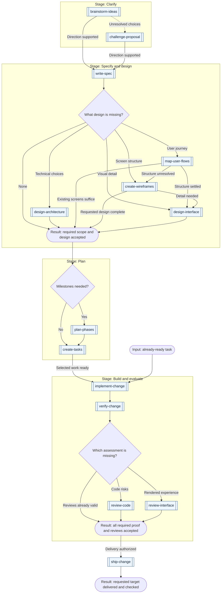

# Skills

63 skills for developing software, evaluating products, coordinating work, designing interfaces, writing content and producing media. Each produces a concrete result, such as a specification, working change, review or media artifact. Run one on its own or continue from another skill's accepted output.

Start with [choose-skill](skills/productivity/choose-skill/SKILL.md) when the next action is unclear. The collection is under active development; [releases](https://github.com/bobalazek/skills/releases) record reviewed snapshots and evaluation limits.

## Install

From your project directory, list the skills and install a selection:

```bash
bunx skills@1.7.0 add bobalazek/skills --list
bunx skills@1.7.0 add bobalazek/skills --skill choose-skill create-tasks verify-change --agent codex --copy
```

Inspect the install summary before confirming. Use `--skill '*'` for the whole collection or `--agent opencode` for OpenCode. Keep each skill's supporting files with it.

For a fixed release, use its tag instead of the default branch:

```bash
bunx skills@1.7.0 add https://github.com/bobalazek/skills/tree/v0.2.0 --skill choose-skill create-tasks verify-change --agent codex --copy
```

`skills@1.7.0` pins the installer; `v0.2.0` pins the 63-skill release. See the [release notes](https://github.com/bobalazek/skills/releases/tag/v0.2.0) for changes and evaluation limits. The catalogs below describe the default branch and may include changes made after this release. Earlier releases remain available.

In Codex, invoke an installed skill with its name and your task:

```text
$choose-skill I have an agreed specification. Help me choose the next planning step.
```

From a checkout, you can also ask a filesystem-capable agent to use `skills/engineering/write-spec/SKILL.md` for a specific feature. The host supplies tools and execution permissions; the skill supplies the procedure.

## Browse by domain

| Catalog | What it covers |
| --- | --- |
| [Engineering · 26 skills](docs/domains/engineering.md) | Understand software, define requirements and architecture, plan work, implement, test, review, deliver, monitor, and maintain it |
| [Product · 6 skills](docs/domains/product.md) | Evaluate ideas, synthesize feedback, compare alternatives, define success measures, plan experiments, and analyze product usage |
| [Productivity · 12 skills](docs/domains/productivity.md) | Explore ideas, research decisions, choose and coordinate work, route requests, improve prompts and team workflows, report status, and transfer context |
| [UI/UX · 8 skills](docs/domains/ui-ux.md) | Capture design references, map flows and navigation, wireframe and design screens, write interface messages, build shared systems, review interfaces, and test usability |
| [Content · 5 skills](docs/domains/content.md) | Define a writing voice, plan page content, write website copy and blog posts, and review prose for clarity and supported meaning |
| [Media · 6 skills](docs/domains/media.md) | Create motion videos, edit recorded footage, record narration, capture product screens, build presentation decks and produce social carousels |

Each catalog lists skills by category, with their outputs and boundaries.

## Common starting points

| What you want | Start with |
| --- | --- |
| Compare directions for an idea | [brainstorm-ideas](skills/productivity/brainstorm-ideas/SKILL.md) |
| Decide whether a product or feature idea merits further investment | [validate-product-idea](skills/product/validate-product-idea/SKILL.md) |
| Begin working in an inherited project | [onboard-codebase](skills/engineering/onboard-codebase/SKILL.md) |
| Establish folder structure, class/file boundaries and naming before planning or coding | [define-project-conventions](skills/engineering/define-project-conventions/SKILL.md) |
| Define a feature's required behavior | [write-spec](skills/engineering/write-spec/SKILL.md) |
| Plan what a product page needs to say and prove | [plan-landing-page](skills/content/plan-landing-page/SKILL.md) |
| Write or revise the words on a website | [write-website-copy](skills/content/write-website-copy/SKILL.md) |
| Turn source material into a blog post | [write-blog-post](skills/content/write-blog-post/SKILL.md) |
| Create a motion graphic or explainer video | [create-motion-video](skills/media/create-motion-video/SKILL.md) |
| Cut, reframe or caption recorded footage | [edit-video](skills/media/edit-video/SKILL.md) |
| Record or generate the narration for a video | [create-voiceover](skills/media/create-voiceover/SKILL.md) |
| Capture product screenshots for marketing or docs | [capture-product-screens](skills/media/capture-product-screens/SKILL.md) |
| Review generic or unclear writing while preserving voice | [review-writing](skills/content/review-writing/SKILL.md) |
| Sketch screen structure from an understood flow | [create-wireframes](skills/ui-ux/create-wireframes/SKILL.md) |
| Add visual detail to settled screen structure | [design-interface](skills/ui-ux/design-interface/SKILL.md) |
| Choose which supplied work fits the available capacity | [prioritize-work](skills/productivity/prioritize-work/SKILL.md) |
| Establish the cause of a known failure | [diagnose-issue](skills/engineering/diagnose-issue/SKILL.md) |
| Review code for evidenced defects | [review-code](skills/engineering/review-code/SKILL.md) |
| Prepare or publish a GitHub release and its notes | [ship-change](skills/engineering/ship-change/SKILL.md) |

See [routes by situation](docs/workflows.md#routes-by-situation) for more examples, including greenfield setup, agent preparation, planning, interface copy, documentation and handoffs.

## From idea to delivery

A spec defines **required behavior**; phases group **deliverable outcomes**; tasks name **executable work and checks**. Start at the next missing result and stop at the requested output.

<details>
<summary>View the feature workflow</summary>

**Key:** double-bordered boxes name individual skills; rounded boxes are inputs/results; diamonds are decisions; frames group stages. Arrows are possible handoffs. A fork alone does not establish parallel readiness.



Select every required design/review branch and reconcile its result before continuing. Failed checks return to repair and independent recheck; delivery waits. Ready tasks can skip planning. Delivery includes checking the requested target.

</details>

The [workflow guide](docs/workflows.md) covers [product discovery](docs/workflows.md#evaluate-a-product-opportunity), sequential and parallel work, review loops and context passed between skills. Recommendations do not authorize additional work.

## Questions

**Do I need every skill or stage?** No. Install the skills you need. Each package is self-contained, loads relevant references as needed and recommends a follow-up only when another result is useful.

**How are results checked?** Use observed proof appropriate to the task. Simple routing, explanations, brainstorming and wording-only drafts can use direct checks where their skill permits it. Consequential acceptance, code changes and delivery retain independent review; PRs include proof and findings when opened. An unavailable required review leaves the result unreviewed. Use `evaluate-skill` to compare actual behavior and preserve regressions; required human approval remains separate.

**Which clients were checked?** For the v0.2.0 release, installation and discovery were checked with skills CLI 1.7.0, OpenCode 1.18.31 and Codex CLI 0.162.1. These checks establish package delivery and metadata discovery for all 63 skills. Behavioral trials are bounded; automatic routing and other client/model combinations remain unverified.

**How do I update?** Copied skills do not update themselves. Review changes and migration notes, preserve local edits, then rerun `add` with the chosen source/tag. Inspect the files and verify discovery again; record the selected version with the project.

## Working on the collection

See the [maintainer guide](docs/authoring.md) for package conventions, evaluation, deprecation and releases. With Bun 1.3.9 or newer, run `bun run check` and `bun test`. There are no package dependencies to install.

## Acknowledgments

This independent collection grows out of workflows I have used internally for several months. Public inspirations include:

- [Matt Pocock's skills](https://github.com/mattpocock/skills): focused questioning and planning, domain vocabulary and decisions, and PR explanations with evidence and risk.
- [HumanLayer's skills](https://github.com/humanlayer/skills): visual PR explanations and concise agent instructions that load detail when needed.
- [Impeccable](https://github.com/pbakaus/impeccable): deliberate visual direction, redesign boundaries and rendered typography and layout checks.
- [Taste Skill](https://github.com/Leonxlnx/taste-skill): comparing an accepted image comp with its implementation and checking rendered media, adapted to the project's constraints.
- [Design with Intent](https://github.com/ghaida/intent): purposeful wireframes, interaction states and concrete accessibility and deceptive-design checks.
- [Emil Kowalski's skills](https://github.com/emilkowalski/skills): motion judged by purpose, repeated use, interruption and observed behavior.
- [Peter Yang's no-ai-slop](https://github.com/petergyang/no-ai-slop): preserving a writer's voice and grounding critiques in specific passages.
- [Animate](https://github.com/cth9191/animate) and [Chase AI's video](https://www.youtube.com/watch?v=rscb1DgJtNg): preview-first procedural video, timed storyboards and frame/export inspection. This collection supplies original instructions and templates; it does not bundle Animate's runtime.

## License

[MIT](LICENSE). Copyright (c) 2026 Borut Balazek.
