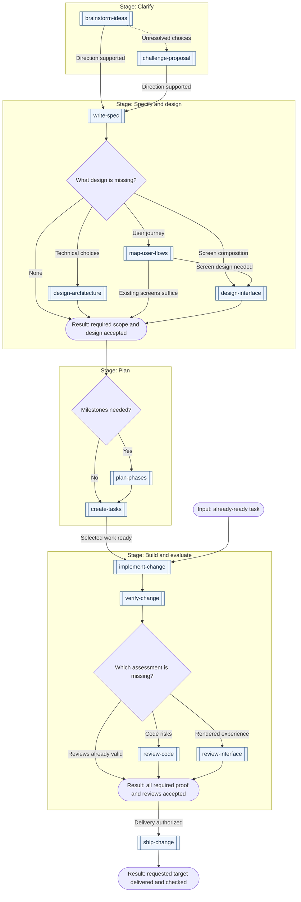

# Skills

Workflows for developing software, making decisions, and designing interfaces. Each skill owns a concrete result and can be used on its own or as a step in a larger process.

The collection contains 40 skills under active development across engineering, productivity, and UI/UX. Each package carries its instructions, conditional resources, and Codex display metadata. Start with [choose-skill](skills/productivity/choose-skill/SKILL.md) when the next action is unclear.

Each final result requires an adversarial review by a separate agent in fresh context. The reviewer checks accepted requirements and raw proof without the author's conversation. Tests, meaningful before/after evidence, and review findings go into the PR when it is opened; required human approval remains separate. A host without independent agents can produce a draft, but cannot satisfy this collection's acceptance gate.

## Install

The repository is private, so installation requires repository access. From your project directory, choose the skills you need from the current default branch:

```bash
bunx skills@1.7.0 add bobalazek/skills --list
bunx skills@1.7.0 add bobalazek/skills --skill choose-skill create-tasks verify-change --agent opencode --copy
```

This installs selected packages into the project, including their supporting files. Inspect the install summary before confirming. Use `--skill '*'` to select the whole collection, or choose a different agent supported by the installer and check discovery in that client. Avoid replacing locally edited skills without comparing those edits first.

For a fixed release, replace `vX.Y.Z` below with a published tag from [GitHub Releases](https://github.com/bobalazek/skills/releases):

```bash
release_tag='vX.Y.Z'
bunx skills@1.7.0 add "https://github.com/bobalazek/skills/tree/$release_tag" --skill choose-skill create-tasks verify-change --agent opencode --copy
```

The version in `skills@1.7.0` pins the installer; the URL selects this collection's release. The [installer's source parser](https://github.com/vercel-labs/skills/blob/v1.7.0/src/source-parser.ts) accepts the tree reference. A default-branch install can change on the next installation; a release tag identifies the reviewed snapshot under our [release policy](docs/authoring.md#releasing-the-collection).

Copied skills do not update themselves. To update, review changes and migration notes, preserve local edits, then rerun `add` for the selected skills using the desired branch or release tag. Inspect the installed files and verify client discovery again. Keep the selected source/tag with the project's install record; switching to a new release is an explicit update.

Local package installation and discovery were checked with skills CLI 1.7.0, OpenCode 1.18.31, and Codex CLI 0.160.0. Codex's `skills/list` read all 40 display names, descriptions and example prompts from `agents/openai.yaml`. These checks cover file delivery and discovery; model behavior, other clients, and automatic routing need their own checks. The workflows remain under evaluation.

Without an installer, point a filesystem-capable agent at a skill in this checkout. To copy one manually, preserve the entire leaf folder containing `SKILL.md` and its resources in your client's skills location, then verify discovery. Domain folders organize this repository; they are not individual skills.

## Browse by domain

| Catalog | What it covers |
| --- | --- |
| [Engineering · 25 skills](docs/domains/engineering.md) | Understand software, define requirements and architecture, plan work, implement, test, review, deliver, and maintain it |
| [Productivity · 9 skills](docs/domains/productivity.md) | Explore ideas, research decisions, route requests, improve prompts and team workflows, report status, and transfer context |
| [UI/UX · 6 skills](docs/domains/ui-ux.md) | Capture design references, map flows, design screens and systems, review interfaces, and test usability |

The catalogs list every skill by category, with its output and boundaries. Engineering includes architecture, quality and operations as well as coding. UI/UX owns user experience and interface decisions; it joins engineering work when the change needs it.

## Common starting points

| What you want | Start with |
| --- | --- |
| Find the next useful action | [choose-skill](skills/productivity/choose-skill/SKILL.md) |
| Compare directions for an idea | [brainstorm-ideas](skills/productivity/brainstorm-ideas/SKILL.md) |
| Question a proposal and its edge cases | [challenge-proposal](skills/productivity/challenge-proposal/SKILL.md) |
| Check an incoming request and decide what it needs | [assess-request](skills/engineering/assess-request/SKILL.md) |
| Begin working in an inherited project | [onboard-codebase](skills/engineering/onboard-codebase/SKILL.md) |
| Understand how existing code works | [explain-codebase](skills/engineering/explain-codebase/SKILL.md) |
| Make project context discoverable by agents | [prepare-repo-for-agents](skills/engineering/prepare-repo-for-agents/SKILL.md) |
| Define a feature's required behavior | [write-spec](skills/engineering/write-spec/SKILL.md) |
| Choose a stack or settle technical boundaries | [design-architecture](skills/engineering/design-architecture/SKILL.md) |
| Define a user journey and its recovery paths | [map-user-flows](skills/ui-ux/map-user-flows/SKILL.md) |
| Design a screen whose flow is understood | [design-interface](skills/ui-ux/design-interface/SKILL.md) |
| Capture useful patterns from an existing interface | [capture-design-reference](skills/ui-ux/capture-design-reference/SKILL.md) |
| Study whether users can complete a task | [test-usability](skills/ui-ux/test-usability/SKILL.md) |
| Report verified project progress and blockers | [report-project-status](skills/productivity/report-project-status/SKILL.md) |
| Improve a recurring team process | [improve-team-workflow](skills/productivity/improve-team-workflow/SKILL.md) |
| Split agreed scope into milestones | [plan-phases](skills/engineering/plan-phases/SKILL.md) |
| Turn a spec or phase into executable work | [create-tasks](skills/engineering/create-tasks/SKILL.md) |
| Set up a new project from accepted choices | [start-project](skills/engineering/start-project/SKILL.md) |
| Implement a ready task or agreed batch | [implement-change](skills/engineering/implement-change/SKILL.md) |
| Establish the cause of a known failure | [diagnose-issue](skills/engineering/diagnose-issue/SKILL.md) |
| Prove a change meets its criteria | [verify-change](skills/engineering/verify-change/SKILL.md) |
| Review code for evidenced defects | [review-code](skills/engineering/review-code/SKILL.md) |
| Review a rendered interface | [review-interface](skills/ui-ux/review-interface/SKILL.md) |
| Prepare or publish a GitHub release and its notes | [ship-change](skills/engineering/ship-change/SKILL.md) |

The [scenario guide](docs/workflows.md#routes-by-situation) adds research, AI architecture, migrations, performance, refactoring, documentation, PR explanations, delivery and handoffs. Each example names the first skill, its result, and the condition for continuing. The router's portable [skill map](skills/productivity/choose-skill/references/skill-map.matrix.md) uses the same boundaries.

## From idea to delivery

A spec defines **what must happen**. A phase plan groups **deliverable outcomes and their order**. Tasks define **who changes what, after which prerequisites, and how to verify it**. This overview shows a feature route; start at the next missing result and stop at the requested output.

**Graph key:** double-bordered boxes are individual skills, labeled with their exact names. Rounded boxes are inputs or results. Diamonds are decisions. Outer frames with a `Stage:` heading group work; they are not skills. Arrows show possible handoffs, with conditions on the branches. A fork alone does not mean work can run in parallel.



Select every design or review branch required by the change; an accepted result waits for all selected branches and their reconciliation. A familiar screen can start directly at `design-interface`, and existing tasks can skip planning. Missing premises need `research-topic` or `build-prototype` before relying on them. Failed checks or blocking findings return to repair and independent recheck; delivery waits. `ship-change` includes checking the requested target. Observed failures can continue through `diagnose-issue`, opportunities through `find-improvements`, or the work can finish.

The [workflow guide](docs/workflows.md) separates lifecycle stages from project phases and shows [parallel phases and tasks](docs/workflows.md#sequential-and-parallel-work), [staged reviews](docs/workflows.md#review-and-recheck), and [the next skill for each result](docs/workflows.md#context-and-next-actions). Each skill can finish on its own; this graph does not authorize the next action.

## Use a workflow

From this checkout, point a filesystem-capable agent to the selected skill and give it the actual task. For example:

```text
Use skills/engineering/write-spec/SKILL.md to define the requested feature.
Use skills/engineering/review-code/SKILL.md to review this branch against main.
```

The skill supplies its procedure and links conditional resources. Reuse its result for the next needed action; check discovery and invocation in the client you use.

Two optional Bun helpers support the work itself:

- [Task-graph checks](skills/engineering/create-tasks/SKILL.md): validate dependencies and inspect ready work, declared write conflicts, and unknown isolation before selecting a batch.
- [Command evidence](skills/engineering/verify-change/SKILL.md): run an explicit check and retain its actual result and observed source state for review. A successful command does not establish that every acceptance criterion passed.

## Working on the collection

Each package lives at `skills/<domain>/<skill>/SKILL.md` and carries its required resources. The [maintainer guide](docs/authoring.md) covers creating and changing skills, validation, deprecation, and [releases](docs/authoring.md#releasing-the-collection). A skill should not need the whole collection installed or the entire repository loaded.

Use Bun 1.3.9 or newer. Run `bun run check` for the collection audit and `bun test` for the audit and helper tests. There are no package dependencies to install. Behavioral trials and client installation checks are separate from this audit.

## Acknowledgments

This collection grows out of workflows I have used internally for several months. These extracted packages are still being evaluated. [Matt Pocock's skills](https://github.com/mattpocock/skills) and [HumanLayer's skills](https://github.com/humanlayer/skills) inspired parts of the approach, including focused questioning, planning, review and clear explanations. This is an independent collection with its own scope across engineering, productivity and UI/UX.

## License

[MIT](LICENSE). Copyright (c) 2026 Borut Balazek.
