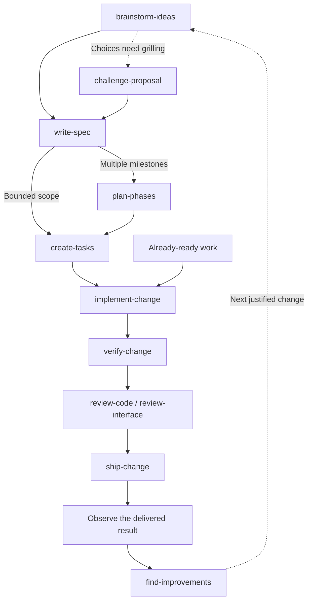

# Skills

Workflows for developing software, making decisions, and designing interfaces. Each skill owns a concrete result and can be used on its own or as a step in a larger process.

The collection contains 36 draft skills across engineering, productivity, and UI/UX. Each package carries its instructions, conditional resources, and Codex display metadata. Start with [choose-skill](skills/productivity/choose-skill/SKILL.md) when the next action is unclear.

Each final result requires an adversarial review by a separate agent in fresh context. The reviewer checks accepted requirements and raw proof without the author's conversation. Tests, meaningful before/after evidence, and review findings go into the PR when it is opened; required human approval remains separate. A host without independent agents can produce a draft, but cannot satisfy this collection's acceptance gate.

## Install

The collection is currently private and has no published release, so installation requires repository access. From your project directory, choose the skills you need from the current default branch:

```bash
bunx skills@1.7.0 add bobalazek/skills --list
bunx skills@1.7.0 add bobalazek/skills --skill choose-skill create-tasks verify-change --agent opencode --copy
```

This installs selected packages into the project, including their supporting files. Inspect the install summary before confirming. Use `--skill '*'` to select the whole collection, or choose a different agent supported by the installer and check discovery in that client. Avoid replacing locally edited skills without comparing those edits first.

For a fixed release, replace `vX.Y.Z` below with an actual published tag. No such release is available yet:

```bash
release_tag='vX.Y.Z'
bunx skills@1.7.0 add "https://github.com/bobalazek/skills/tree/$release_tag" --skill choose-skill create-tasks verify-change --agent opencode --copy
```

The version in `skills@1.7.0` pins the installer; the URL selects this collection's release. The [installer's source parser](https://github.com/vercel-labs/skills/blob/v1.7.0/src/source-parser.ts) accepts the tree reference. A default-branch install can change on the next installation; a release tag identifies the reviewed snapshot under our [release policy](docs/authoring.md#releasing-the-collection).

Copied skills do not update themselves. To update, review changes and migration notes, preserve local edits, then rerun `add` for the selected skills using the desired branch or release tag. Inspect the installed files and verify client discovery again. Keep the selected source/tag with the project's install record; switching to a new release is an explicit update.

Local package installation and discovery were checked with skills CLI 1.7.0 and OpenCode 1.18.31. This verifies package discovery and file delivery; model behavior, other clients, and automatic routing need their own checks. The workflows remain drafts under evaluation.

Without an installer, point a filesystem-capable agent at a skill in this checkout. To copy one manually, preserve the entire leaf folder containing `SKILL.md` and its resources in your client's skills location, then verify discovery. Domain folders organize this repository; they are not individual skills.

## Browse by domain

| Catalog | What it covers |
| --- | --- |
| [Engineering · 25 skills](docs/domains/engineering.md) | Understand software, define requirements and architecture, plan work, implement, test, review, deliver, and maintain it |
| [Productivity · 7 skills](docs/domains/productivity.md) | Explore ideas, question proposals, research decisions, route requests, improve prompts, and transfer context |
| [UI/UX · 4 skills](docs/domains/ui-ux.md) | Map user flows, design screens, build shared design systems, and review rendered experiences |

The catalogs list every skill by category, with its output and boundaries. Engineering includes architecture, quality and operations as well as coding. UI/UX owns user experience and interface decisions; it joins engineering work when the change needs it.

## Common starting points

| What you have | Useful first action |
| --- | --- |
| An idea with several possible directions | [brainstorm-ideas](skills/productivity/brainstorm-ideas/SKILL.md) to compare approaches |
| A proposal you want grilled | [challenge-proposal](skills/productivity/challenge-proposal/SKILL.md) to question assumptions and edge cases |
| A user journey or screen to design | [map-user-flows](skills/ui-ux/map-user-flows/SKILL.md), or [design-interface](skills/ui-ux/design-interface/SKILL.md) when the flow is settled |
| An unfamiliar existing project | [onboard-codebase](skills/engineering/onboard-codebase/SKILL.md) to establish the working baseline |
| An incoming request or a known failure | [assess-request](skills/engineering/assess-request/SKILL.md) to check and route the request; [diagnose-issue](skills/engineering/diagnose-issue/SKILL.md) to establish a failure's cause |
| Agreed intent that needs precise behavior | [write-spec](skills/engineering/write-spec/SKILL.md) to define scenarios and acceptance criteria |
| A ready task or agreed batch | [implement-change](skills/engineering/implement-change/SKILL.md) to do the scoped work |
| A change that needs proof or review | [verify-change](skills/engineering/verify-change/SKILL.md) for observed acceptance evidence; [review-code](skills/engineering/review-code/SKILL.md) or [review-interface](skills/ui-ux/review-interface/SKILL.md) for findings |

## From idea to delivery

A spec defines **what must happen**. A phase plan groups **deliverable outcomes and their order**. Tasks define **who changes what, after which prerequisites, and how to verify it**. Use the steps the request needs; a small change can skip a phase plan, and ready work can start with implementation.



The [workflow guide](docs/workflows.md) adds research and design branches, bug fixes, greenfield and inherited-project routes, and concrete sequential/parallel examples. It explains where human clarification happens and how specs, phases, tasks and PRs relate. Each skill can also finish on its own; this graph does not authorize the next action.

## Use a workflow

From this checkout, point a filesystem-capable agent to the selected skill and give it the actual task. For example:

```text
Use skills/engineering/write-spec/SKILL.md to define the requested feature.
Use skills/engineering/review-code/SKILL.md to review this branch against main.
```

The skill supplies its procedure and links conditional resources. Reuse its result for the next needed action; check discovery and invocation in the client you use.

Two optional Bun helpers support the work itself:

- [Task-graph checks](skills/engineering/create-tasks/SKILL.md): validate dependencies and inspect ready work, declared write conflicts, and unknown isolation before selecting a batch.
- [Command evidence](skills/engineering/verify-change/SKILL.md): run an explicit check and retain its actual result and observed source state for review. A successful command does not establish that every acceptance criterion passed.

## Working on the collection

Each package lives at `skills/<domain>/<skill>/SKILL.md` and carries its required resources. The [maintainer guide](docs/authoring.md) covers creating and changing skills, validation, deprecation, and [releases](docs/authoring.md#releasing-the-collection). A skill should not need the whole collection installed or the entire repository loaded.

Use Bun 1.3.9 or newer. Run `bun run check` for the collection audit and `bun test` for the audit and helper tests. There are no package dependencies to install. Behavioral trials and client installation checks are separate from this audit.

## License

[MIT](LICENSE). Copyright (c) 2026 Borut Balazek.

Include the root `LICENSE` when copying or redistributing standalone skills. The installer copies skill folders but does not include this file automatically.
