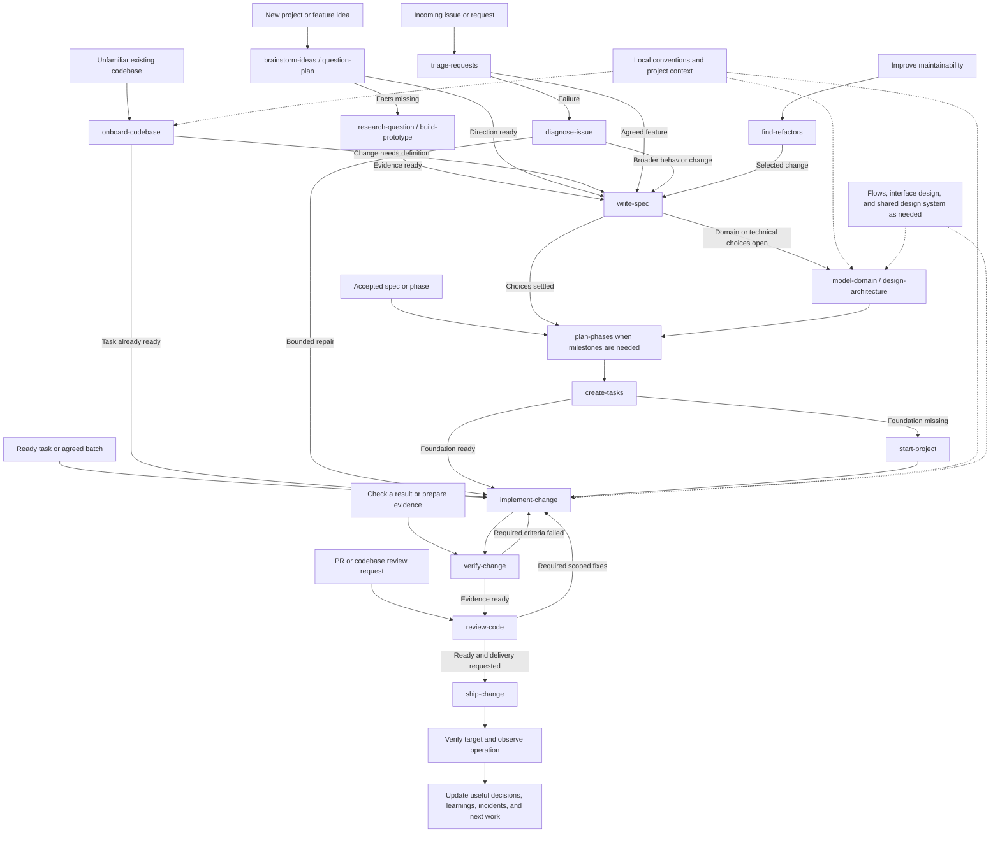
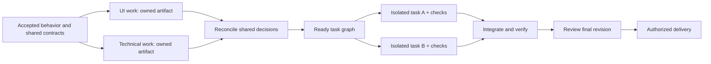

# Workflows

Select the requested result, use the narrowest matching skill, and carry accepted context forward. A workflow describes dependencies; the host supplies any actual scheduling, workers, isolation, and tools.

## Phases

| Phase | Purpose | Ready to continue when |
| --- | --- | --- |
| Intake | Establish the requested outcome, scope, starting point, and authority | The next action and material missing prerequisites are clear |
| Research | Inspect current reality or answer an uncertainty through code, sources, diagnosis, or experiments | Evidence supports a decision; unknowns are explicit |
| Planning | Define desired behavior, domain/technical choices, phases, and tasks as needed | Selected work has settled prerequisites and observable acceptance |
| Implementation | Make the scoped change under local conventions and update affected context | The requested behavior and relevant checks have observed evidence |
| Verification | Evaluate material criteria and collect usable proof of the result | Required behavior is demonstrated, evidence identifies its revision/context, and gaps are explicit |
| Review | Evaluate the selected result against intent and engineering/interface requirements | Findings, coverage, blocking fixes, and remaining risks are explicit |
| Delivery | Reach the requested PR, release, deployment, or handover target | The actual target and revision/artifact/behavior are verified |
| Operation | Observe the result, recover from incidents, and learn from use | Verified observations identify the next useful action or no further work |

Clarification belongs wherever a consequential unknown occurs. A prototype creates research evidence even when code is used to build it. Verification can happen within implementation or as a dedicated `verify-change` pass; reuse completed checks that still apply. No phase requires a separate document or conversation turn. Relevant tests and checks are required; their order does not follow a mandatory test-first method.

## Lifecycle graph

Solid arrows show a useful route; labels identify conditional transitions. A ready task can enter implementation directly.

Operational feedback re-enters through the relevant request: diagnosis for a failure, specification for changed behavior, or scoped upkeep. Reuse the delivered revision and observations. For a selected phase that already has milestones, go directly to `create-tasks`; the graph does not require re-planning it.

## Routes by situation

| Situation | Useful route |
| --- | --- |
| Greenfield project | Brainstorm/question → relevant research or prototype → spec → domain/technical design as needed → phases/tasks → starter/foundation → implementation → review → requested delivery |
| Inherited project | Onboard → preserve current behavior/data/contracts → select the actual change → define missing conventions/context only where needed → use the ordinary change route |
| Feature in a familiar project | Inspect the affected baseline → spec if behavior is unclear → design/task decomposition only where useful → implement/review/deliver |
| Bug or regression | Triage if the report is unverified → diagnose → implement the bounded repair → check affected consumers → review/deliver as requested |
| Result evaluation | Select checks from acceptance criteria → preserve useful baseline → observe candidate behavior → report results and evidence → include proof in authorized PR/delivery work |
| Refactor | Find evidenced candidates → select one → preserve behavior and define checks → implement the accepted scope → review |
| Large uncertain initiative | Map project decisions → research/question/prototype the next ready choice → specify and plan sufficiently settled portions |
| PR communication | Explain the fixed comparison; question unresolved intent when needed; use review separately for correctness |
| UI work | Map flows → design the interface → build/evolve shared foundations only for repeated needs → implement → inspect/review rendered behavior |
| Documentation cleanup | Consolidate existing authoritative content and links; prepare agent entry points only where needed |

## Sequential and parallel work

Sequence work when one result determines another task's input. Required domain rules precede dependent contracts; shared schemas/foundations precede consumers; accepted behavior precedes its executable tasks; integration and relevant verification precede delivery.

Parallel work needs ready inputs, independently checkable outputs, and isolated writes/state/data/verification environments. Different filenames alone do not establish independence. Read-only specialist investigations or reviews can run together on a fixed baseline. UI and technical design can run together once shared behavior is clear, with reconciliation before their consumers are implemented.

The coordinator owns shared decisions, reconciliation, integration, and readiness. Use host-supported workers/workspaces when available; Markdown instructions do not implement a scheduler. Small work remains sequential when delegation adds no useful independence.

## Context and next actions

Pass the accepted objective, relevant artifacts, decisions, scope, repository revision/baseline, unresolved prerequisites, and verification evidence. Recheck stale inputs affected by later changes; retain unaffected discoveries. Each result should state the next useful action and why it fits.

| Completed result | Next action when needed |
| --- | --- |
| Selected idea with enough evidence | Write the behavior spec |
| Spec with unresolved technical choices | Design the relevant architecture; use a prototype for unproven feasibility |
| Accepted scope and design | Plan outcome-based phases, or create tasks directly for a small change |
| Agreed phase | Create executable tasks preserving its criteria and dependencies |
| Ready tasks | Establish a missing foundation, then implement one task or the agreed ready batch |
| Implemented change with proof missing | Verify the affected criteria and capture useful evidence |
| Verified change | Review the final revision using its evidence; include relevant proof when explaining or publishing the PR |
| Review findings | Investigate uncertain claims and implement selected authorized fixes; recheck affected evidence |
| Reviewed change and delivery authority | Deliver to the requested target and verify it |

A bounded request finishes with its result and a recommendation. An authorized end-to-end request continues through ready stages without invented confirmation stops. Use `prepare-handoff` for an actual owner/session transfer, not between every skill.

Recommendations can name another skill, but invocation depends on host support and installation. Each skill remains useful alone; describe the next plain action if its sibling is unavailable.

## Artifacts and side effects

Update existing authoritative records. Current behavior, a specification, a decision, a learning, an incident, and a contributor standard have different roles, but they do not require empty folders or a new file every time context moves.

Keep task-system integration within the requested destination and authority. Inspect project/state/concurrency rules and existing items before remote writes. Preserve local work, secret values, and private records. Delivery, production changes, destructive operations, and external communication require the actual action's authority; already-granted authority remains valid.

A check invocation is not evidence of success. Inspect outcomes and report exact failures or unavailable checks. A prototype is not production-ready software; a scoped review does not prove the whole system correct; a command completing does not prove the remote target is healthy.

Verification records the material criterion, tested revision/environment, actual observation, and result. Visible changes use relevant rendered evidence; performance/data claims use comparable measurements; behavioral changes use reproducible interactions or check output. New behavior need not invent a historical baseline. PRs carry concise results and useful accessible artifact links, with comparison conditions and unchecked coverage. Inspect and redact evidence before authorized sharing, verify uploaded locations, and label anything still local. After follow-up edits, refresh the affected proof and PR claims.
