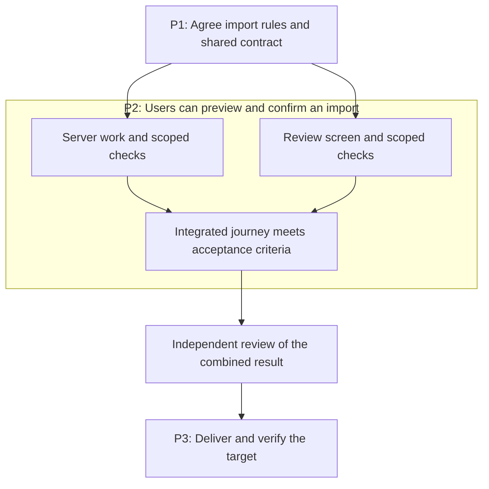

# Workflows

Select the requested result, use the narrowest matching skill, and carry accepted context forward. A workflow describes dependencies; the host supplies any actual scheduling, workers, isolation, and tools.

If the starting point is unclear, use `choose-skill` to recommend the next action from the current state. A ready task can go straight to its owning skill.

## Choose the result you need

The [README graph](../README.md#from-idea-to-delivery) shows the overall route. Start from what is already known, then use this table to find the next missing result.

| You need | Skill | Result | Skip when |
| --- | --- | --- | --- |
| Alternatives to an unclear idea | `brainstorm-ideas` | Different approaches, trade-offs and a proposed direction | The direction is settled |
| A grilling session for a proposal | `challenge-proposal` | Consequential questions answered, edge cases exposed, proposal updated | No material choice blocks the requested result |
| Evidence for an uncertain premise | `research-topic` or `build-prototype` | A sourced answer or observed experiment | Existing evidence answers the uncertainty |
| Precise required behavior | `write-spec` | Scenarios, constraints and observable acceptance criteria in a spec, PRD or issue | The accepted requirements already suffice |
| Several deliverable milestones | `plan-phases` | Outcomes, prerequisites, parallel conditions and phase exits | The change fits one bounded work item or small task set |
| Executable work | `create-tasks` | Owned tasks with criteria, dependencies and checks, locally or in the authorized tracker | Suitable tasks already exist |
| Proof of a changed result | `verify-change` | Observed criterion-by-criterion evidence and gaps | Current, independently evaluated evidence already covers the result |

Research, planning, implementation, verification, delivery and operation are lifecycle stages. A **delivery phase** is a milestone inside a particular project, such as “users can preview an import.” `plan-phases` creates those project milestones; it does not require a task to traverse every lifecycle stage. `create-tasks` creates work items, not skills.

A spec can include intended delivery slices and known dependencies when they explain scope or rollout. `plan-phases` owns the detailed milestone graph; `create-tasks` owns executable dependencies. During brainstorming, ordering and parallelism are hypotheses until the relevant behavior and shared contracts are agreed. Reuse one authoritative document or tracker where possible, rather than copying the same requirements into several files.

## Where clarification happens

Every skill resolves missing input for its own outcome. Use `challenge-proposal` for a dedicated grilling session: inspect what can be discovered, ask the highest-impact unresolved question, follow the answer, and update the existing proposal. Ask about actors, boundaries, failures, recovery and preservation only where their answers could change the result. Explain the trade-off and let the human make choices that belong to them. Do not ask a fixed questionnaire or reopen accepted answers.

A clarified proposal is not a validated concept: demand, feasibility, and performance assumptions need relevant evidence. Use research or a bounded prototype for those claims. An unanswered consequential choice blocks only the work that depends on it; unrelated investigation can continue. Stop questioning when the requested result is sufficiently clear, and carry accepted answers into the spec, phases and tasks.

## Routes by situation

| Situation | Useful route |
| --- | --- |
| Greenfield project | `brainstorm-ideas` → grill consequential choices with `challenge-proposal` → research/prototype missing evidence → `write-spec` → domain/architecture and user flows where needed → phases for multiple milestones, then tasks → `start-project` for a missing foundation → implement, verify, review, deliver and observe |
| Inherited project | `onboard-codebase` → preserve current behavior/data/contracts → select the actual change → define missing conventions/context only where needed → use the ordinary change route; a familiar feature does not need whole-project onboarding |
| Missing project knowledge | `document-project` → verify code, configuration, relevant history and accepted choices → update canonical docs and useful memory indexes → establish disputed rules or improve agent navigation only where needed |
| Architecture or AI capability | Establish product/workload and existing infrastructure constraints → `design-architecture` for boundaries, C4, services, costs and conditional AI contracts → prototype unresolved feasibility → plan/implement → exercise actual data/tool/approval boundaries → deliver and observe |
| Feature in a familiar project | Inspect the affected baseline → `write-spec` for missing behavior → relevant design choices → `create-tasks` directly for bounded scope, or `plan-phases` first for several milestones → implement/verify/review/deliver → observe |
| Incoming request | `assess-request` → check evidence, duplicates, impact and missing information → choose diagnosis, specification, a support answer, or a justified closure recommendation; tracker changes require their own authority |
| Bug or regression | `diagnose-issue` using reproduction and available signals → `implement-change` for the bounded repair → verify affected consumers → review/deliver → consider an automated guard for a recurring cause. Clarify changed product behavior before treating it as a bug fix |
| Result evaluation | Select checks from acceptance criteria → preserve useful baseline → observe candidate behavior → report results and evidence → include proof in authorized PR/delivery work |
| Improvement discovery | `find-improvements` across the requested repository, feature, or data layer → deduplicate confirmed candidates → choose the next investigation or scoped change |
| Refactor | Find evidenced candidates → select one → preserve behavior and define checks → implement the accepted scope → verify/review |
| Repeated coding mistake | Establish the accepted rule → `automate-code-checks` using existing enforcement where possible → demonstrate invalid failure and valid passes → adopt through normal review/delivery |
| Performance | `improve-performance` to measure/profile a representative path → repair when requested → compare correct behavior under equivalent conditions → review/deliver |
| Dependency upkeep | `upgrade-dependencies` to establish a compatible set and adapt consumers → verify resolution and runtime behavior → review/deliver |
| System or data transition | Settle the target architecture → `plan-migration` for compatibility, transfer, cutover, and recovery → phases/tasks → execute authorized stages with evidence gates |
| Large uncertain initiative | `track-project-decisions` → research/challenge/prototype the next ready choice → specify and plan sufficiently settled portions |
| PR explanation or review | `explain-pr` communicates a fixed comparison; `challenge-proposal` resolves consequential unknown intent; `review-code` evaluates correctness. Use the requested one, without an automatic three-step ceremony |
| New or changed user journey | `map-user-flows` → clarify consequential behavior with the product owner → `design-interface` for selected screens/states → implementation → `verify-change` and `review-interface` on the rendered result |
| Established screen or shared components | Start with `design-interface` for the screen; use `build-design-system` only for repeated component/token needs. A rendered audit starts directly with `review-interface` |
| Documentation cleanup | Consolidate existing authoritative content and links; prepare agent entry points only where needed |

If the request stops at a spec, explanation, design or review, return that result and the next useful action. Continue a broader workflow when it is already authorized. A small change may need no new planning document. `verify-change` also applies to changed docs or plans through scenario checks, consistency, links and rendered diagrams; it does not impose a code test suite on every artifact. Reuse valid proof, with independent evaluation, instead of duplicating a completed verification pass. Testing is required where relevant; test-first sequencing is not mandatory.

After delivery, inspect the requested health signals and actual target. Route a failure back to diagnosis or a justified opportunity to `find-improvements`. Available monitoring supports this observation; the skills do not install a platform or promise a continuous watch. Carry useful decisions, learnings and incidents into existing project records.

## Sequential and parallel work

Sequence work when one result determines another task's input. Required domain rules precede dependent contracts; shared schemas/foundations precede consumers; accepted behavior precedes its executable tasks; integration and relevant verification precede delivery.

`plan-phases` identifies which milestones can overlap and what closes each one. `create-tasks` preserves those dependencies while splitting a selected phase into owned, verifiable work. Distinguish work that could run together after named prerequisites from work ready now. A phase may start only when its own prerequisites hold; a task inside it may still wait on another task. Publish to the requested project-management destination only after checking existing work and granted write authority; reconcile uncertain writes before retrying and confirm stored results before claiming synchronization.

Parallel work needs ready inputs, independently checkable outputs, and isolated writes/state/data/verification environments. Different filenames alone do not establish independence. Read-only specialist investigations or reviews can run together on a fixed baseline. UI and technical design can run together once shared behavior is clear, with reconciliation before their consumers are implemented.

For example, a CSV import might use these delivery phases, with parallel tasks inside P2. This is a dependency illustration, not a declaration that any phase or task is already accepted:

The server and screen tasks are parallel candidates after P1 is accepted. The screen can use contract fixtures while the server is built, provided workspaces, shared files and test state do not conflict. If both tasks edit the same generated client or reset the same database, assign that shared change to one owner or serialize it. P2 exits only after both branches integrate and their combined behavior is independently accepted; fixture-based checks cannot replace that evidence.

`create-tasks` makes the same dependencies concrete inside each selected phase: a migration precedes queries that require its schema; two read-only reviews of a fixed revision can overlap; a PR requiring both branches waits for their integrated evidence. Planning a future parallel branch does not make it ready to run today.

The coordinator owns shared decisions, reconciliation, integration, and readiness. Use host-supported workers/workspaces when available; Markdown instructions do not implement a scheduler. Small work remains sequential when delegation adds no useful independence.

Evaluation always uses a separate agent in fresh context, including for plans, research, code, and designs. Supply accepted criteria, the fixed candidate, relevant raw sources, and check access without the author's conversation or preferred conclusion. The reviewer tries to disprove material claims and inspects actual proof. Add reviewers only for distinct risks; preserve demonstrated defects through reconciliation and independently recheck affected results after fixes. Without an independent reviewer, the result remains unreviewed and cannot pass acceptance. This is separate from the user's required decisions and approvals.

A worker may not receive the parent conversation. Give it a bounded question or outcome, source scope/baseline, applicable instructions, accepted criteria, permitted actions and owned writes, expected evidence, and stop conditions. Research returns located findings and unresolved claims; the coordinator checks consequential evidence before adopting conclusions. Use host controls where available: separate context does not establish isolation of files, services, or credentials.

## Specs, tasks and PRs

A spec is the behavior contract; a phase is a deliverable milestone; a task is an owned unit of work; a PR is a review and integration boundary. They do not map one-to-one. One phase may need several PRs. Several small tasks may belong in one coherent PR. Split PRs by independently reviewable behavior, dependencies and safe integration, not merely by frontend/backend folders or task count.

Link a task's acceptance criteria to the relevant spec IDs and phase exits. A proposed PR group records included tasks, prerequisite PRs or contracts, preserved behavior, verification and recovery conditions. Follow the repository's branch/stack policy, and identify incomplete feature slices honestly. Do not invent a PR number or mark a milestone delivered because its first task merged.

At PR creation, describe the actual change and include observed checks, useful before/after evidence, independent findings and their disposition, plus remaining gaps. Use `explain-pr` when an explanation is the requested result, `review-code` for correctness and risk findings, and `ship-change` to reach an authorized delivery target. An intent question is not a correctness finding; an explanation is not approval to merge.

## Context and next actions

Pass the accepted objective, relevant artifacts and their versions where material, decisions, scope, repository revision/baseline, unresolved prerequisites, and verification evidence. Reconcile copied task criteria with authoritative inputs after a change; retain unaffected discoveries. For partial batches, preserve each task's outputs and actual disposition, stop dependent work when its prerequisite fails, and resume from observed state. Integration needs evidence for the combined revision. Each result should state the next useful action and why it fits.

Before context loss or an actual session transfer, condense those facts into the existing work record or a short continuation block, retaining pending operation IDs and useful file/symbol pointers. Remove repeated logs and search noise; retain authority, blockers and unchecked criteria. On resumption, reload applicable instructions and compare against current sources/state. Summaries guide that check; they do not replace evidence or require a new document or session.

| Completed result | Next action when needed |
| --- | --- |
| Selected idea with enough evidence | Write the behavior spec |
| Spec with unresolved technical choices | Design the relevant architecture; use a prototype for unproven feasibility |
| Accepted scope and design | Plan outcome-based phases, or create tasks directly for a small change |
| Agreed phase | Create executable tasks preserving its criteria and dependencies |
| Ready tasks | Establish a missing foundation, then implement one task or the agreed ready batch |
| Implemented change with proof missing | Verify the affected criteria and capture useful evidence |
| Verified change | Review the final revision using its evidence; include relevant proof when explaining or publishing the PR |
| Review findings | Investigate uncertain claims and implement selected authorized fixes; recheck affected evidence |
| Reviewed change and delivery authority | Deliver to the requested target and verify it |
| Delivery observed | Diagnose failures, prioritize evidenced improvements, or record that no follow-up is justified; carry the observations into the next cycle |

A bounded request finishes with its result and a recommendation. An authorized end-to-end request continues through ready stages without invented confirmation stops. Use `prepare-handoff` for an owner/session transfer or context compaction, not between every skill.

Recommendations can name another skill, but invocation depends on host support and installation. Each skill remains useful alone; describe the next plain action if its sibling is unavailable.

## Artifacts and side effects

Update existing authoritative records. Current behavior, a specification, a decision, a learning, an incident, and a contributor standard have different roles, but they do not require empty folders or a new file every time context moves. Use a memory index when it improves retrieval: link records with scope/status and a refresh trigger rather than copying their contents. Keep temporary run state separate; conflicting or stale memory requires evidence before reuse. AGENTS.md points to the applicable project knowledge.

At task or workflow completion, follow the requested audience, tone, depth and project template. Default to a concise result, its purpose, the relevant method, observed verification and exact gaps or next action. A technical walkthrough can be detailed when requested; a PR should let a reviewer understand the changed behavior and evidence quickly. Update durable knowledge in place and link it from the summary. Repeated summaries are not new sources of truth.

Keep task-system integration within the requested destination and authority. Inspect project/state/concurrency rules and existing items before remote writes. Preserve local work, secret values, and private records. Delivery, production changes, destructive operations, and external communication require the actual action's authority; already-granted authority remains valid.

A check invocation is not evidence of success. Inspect outcomes and report exact failures or unavailable checks. A prototype is not production-ready software; a scoped review does not prove the whole system correct; a command completing does not prove the remote target is healthy.

Verification records the material criterion, tested revision/environment, actual observation, and result. Visible changes use relevant rendered evidence; performance/data claims use comparable measurements; behavioral changes use reproducible interactions or check output. New behavior need not invent a historical baseline. PRs carry concise results and useful accessible artifact links, with comparison conditions and unchecked coverage. Inspect and redact evidence before authorized sharing, verify uploaded locations, and label anything still local. After follow-up edits, refresh the affected proof and PR claims.
