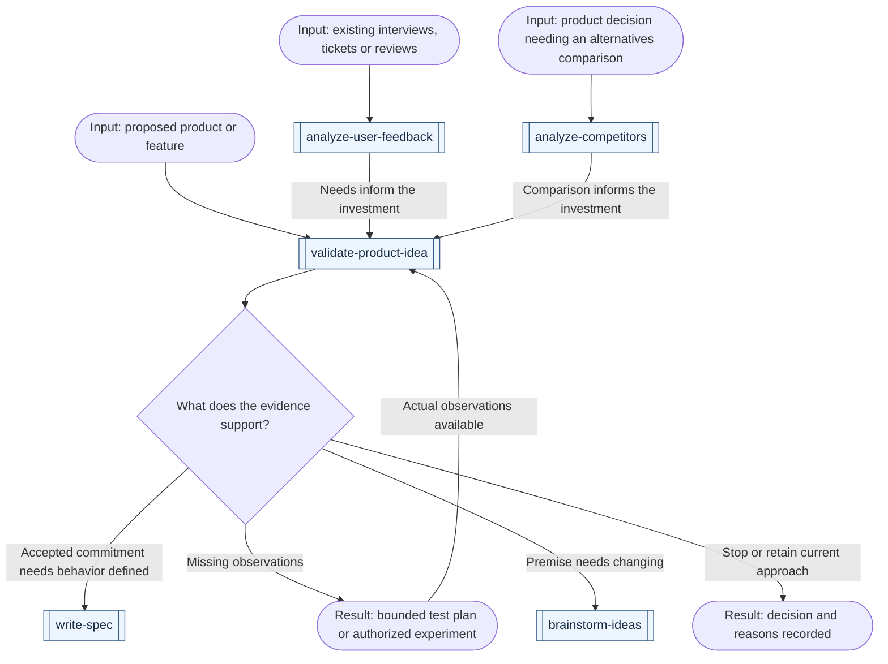
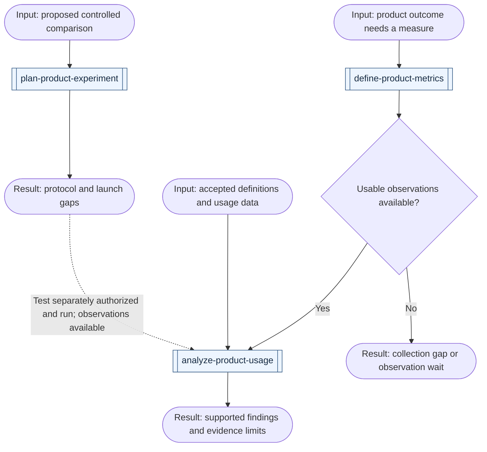
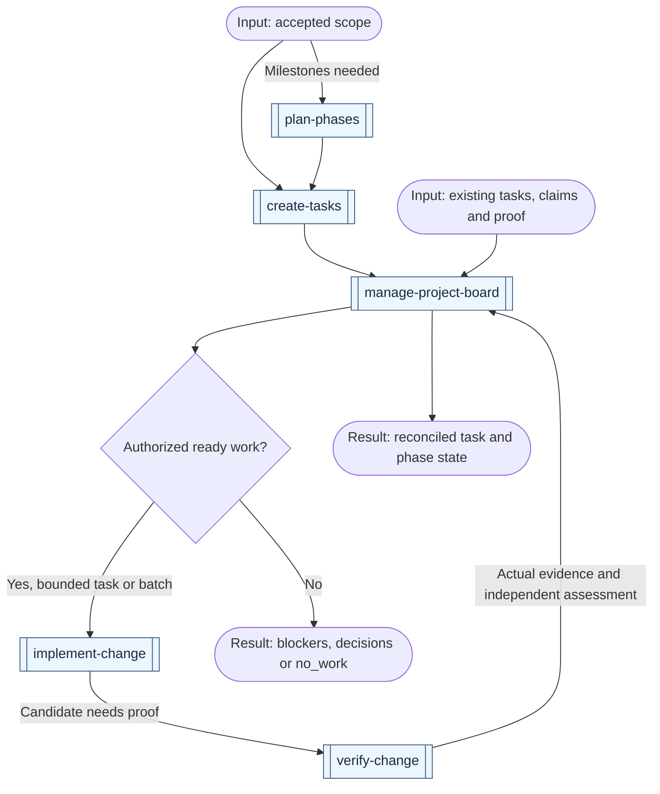
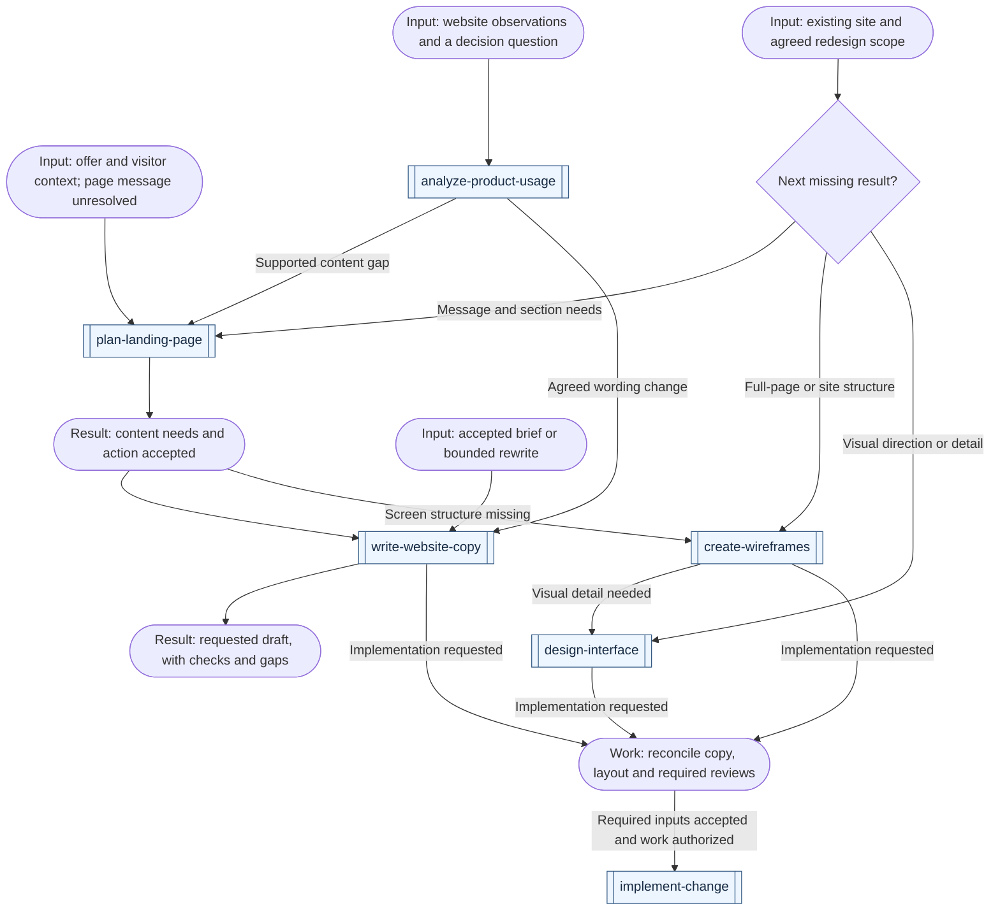
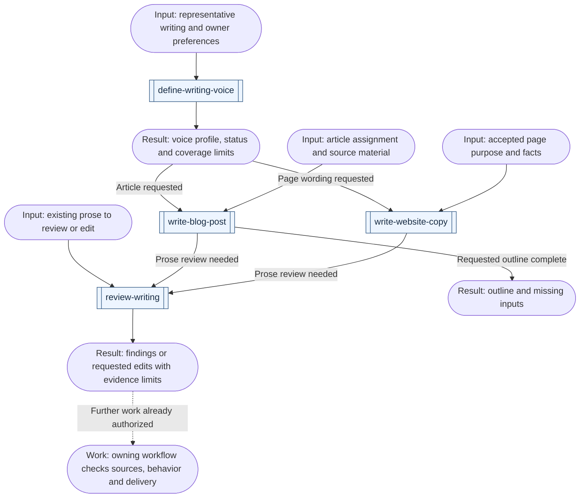
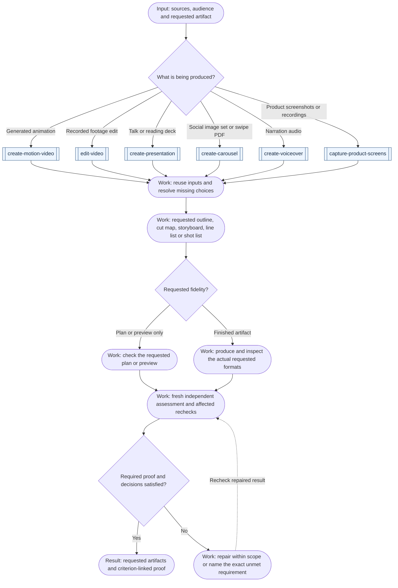
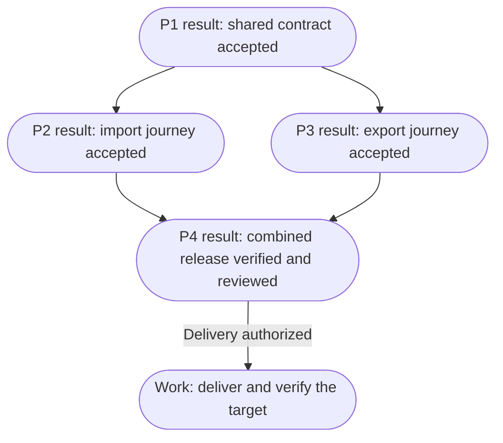
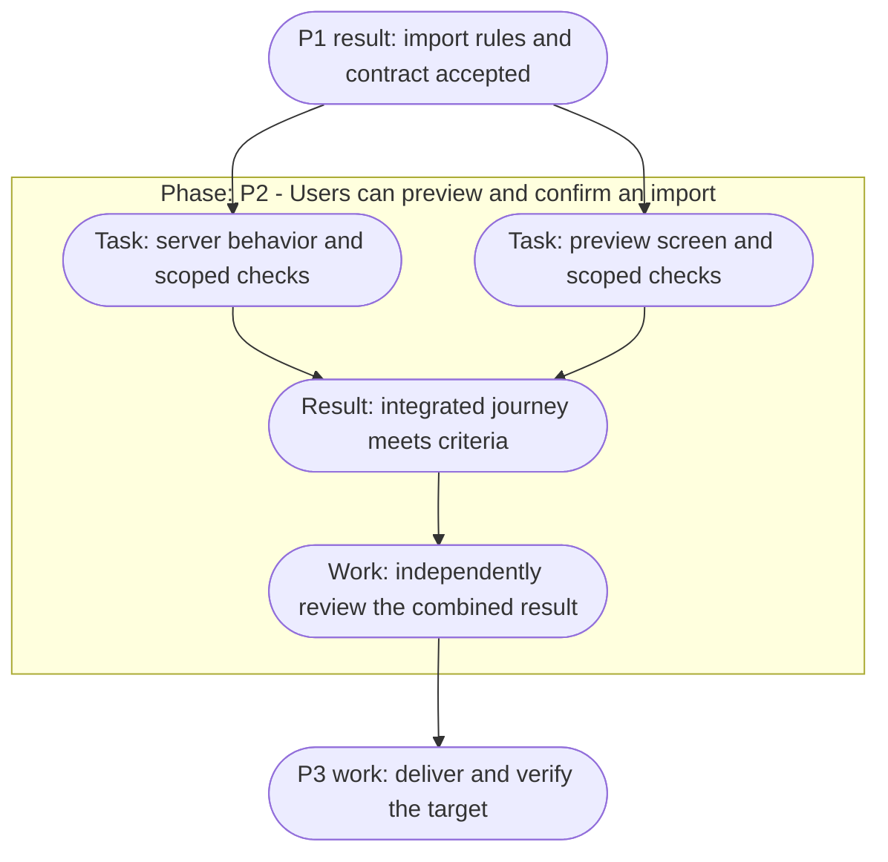
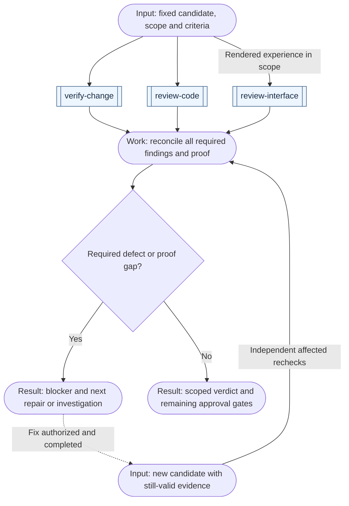

# Workflows

Select the requested result, use the narrowest matching skill, and carry accepted context forward. A workflow describes dependencies; the host supplies any actual scheduling, workers, isolation, and tools.

If the starting point is unclear, use `choose-skill` to recommend the next action from the current state. A ready task can go straight to its owning skill.

Start with [request scenarios](#routes-by-situation), [parallel phases and tasks](#sequential-and-parallel-work), or [review and recheck](#review-and-recheck). The [portable router map](../skills/productivity/choose-skill/references/skill-map.matrix.md) distinguishes each skill's output; the scenarios below show how to use those boundaries in a request.

## Reading the graphs

Double-bordered boxes name one skill using its exact install name. Rounded boxes describe inputs, results or work within a scenario. Diamonds ask a routing or readiness question. Outer frames labeled `Stage:` or `Phase:` group work; their headings cannot be invoked. Shapes and labels carry the distinction even without color.

In skill-route graphs, arrows show possible next actions, with conditions on branches. Select the branches the requested outcome needs, reconcile all required outputs, and reuse valid completed work. A fork does not by itself authorize parallel execution. In the phase/task examples, arrows are prerequisite dependencies: a join waits for every incoming required output. Each example states which meaning applies.

## Choose the result you need

The [README graph](../README.md#from-idea-to-delivery) shows the overall route. Start from what is already known, then use this table to find the next missing result.

| You need | Skill | Result | Skip when |
| --- | --- | --- | --- |
| Alternatives to an unclear idea | `brainstorm-ideas` | Different approaches, trade-offs and a proposed direction | The direction is settled |
| Questions that challenge a proposal | `challenge-proposal` | Consequential questions answered, edge cases exposed, proposal updated | No material choice blocks the requested result |
| Evidence for an uncertain premise | `research-topic` or `build-prototype` | A sourced answer or observed experiment | Existing evidence answers the uncertainty |
| Evidence for a product investment | `validate-product-idea` | A supported decision or bounded validation plan | The relevant need and commitment already have sufficient evidence |
| Needs from existing feedback | `analyze-user-feedback` | Sourced needs with reconciled counts, contrary evidence and coverage limits | Relevant synthesis is already available |
| A comparison of product alternatives | `analyze-competitors` | Dated differences and implications for a named product decision | The existing comparison still fits the decision and date |
| Defined product success measures | `define-product-metrics` | A measurement contract with source and quality requirements | Accepted definitions already answer the decision |
| A controlled experiment protocol | `plan-product-experiment` | Assignment, measures, feasibility, stopping and decision rules before launch | A suitable accepted protocol already exists |
| Findings from product behavior data | `analyze-product-usage` | Checked counts, comparisons and evidence limits | Current analysis already covers the question and observation window |
| Precise required behavior | `write-spec` | Scenarios, constraints and observable acceptance criteria in a spec, PRD or issue | The accepted requirements already suffice |
| A product page's message and content needs | `plan-landing-page` | Audience, supported claims, proof and content sequence | The existing brief already settles these choices |
| Actual website wording | `write-website-copy` | Page or section copy with exact evidence gaps | The accepted wording already meets the request |
| Reusable language conventions | `define-writing-voice` | A source-backed personal or brand voice profile and contextual tone | An applicable approved guide already meets the need |
| An article from source material | `write-blog-post` | A supported blog draft, tutorial, revision or requested outline | The accepted article already meets the request |
| Findings about existing prose | `review-writing` | Exact quoted issues or requested edits preserving meaning and voice | Valid findings or accepted wording already cover the request |
| A motion graphic, explainer or its requested preview | `create-motion-video` | Brief, timed script/storyboard and requested export with scoped playback proof | Accepted production artifacts already meet the requested fidelity |
| A recorded-footage edit, deck or social carousel | `edit-video`, `create-presentation` or `create-carousel` | The requested media artifact with editable source and format-specific proof | Accepted artifacts already meet the requested fidelity |
| Narration audio for a video, edit or deck | `create-voiceover` | One clip per line, a voice stem and a timing manifest with pronunciation, loudness and listening evidence | An accepted recording and manifest already match the script |
| Real product captures for media or documentation | `capture-product-screens` | Reproducible seeded screenshots or recordings with a shot manifest and forbidden-content checks | Current captures still match the interface and the copy they accompany |
| Screen structure before visual detail | `create-wireframes` | Editable layouts with hierarchy, content/state placement and requirement links | Existing or accepted screen structure already resolves the question |
| Several deliverable milestones | `plan-phases` | Outcomes, prerequisites, parallel conditions and phase exits | The change fits one bounded work item or small task set |
| Executable work | `create-tasks` | Owned tasks with criteria, dependencies and checks, locally or in the authorized tracker | Suitable tasks already exist |
| Current local work state and next pickup | `manage-project-board` | Reconciled Markdown tasks, owners, blockers and ready work | Existing coordination already meets the request |
| Proof of a changed result | `verify-change` | Observed criterion-by-criterion evidence and gaps | Current, independently evaluated evidence already covers the result |
| Useful service monitoring and alerts | `configure-monitoring` | Configured detection and response routes with scoped firing/delivery/recovery proof | Current coverage and evidence already meet the requested need |

Research, planning, implementation, verification, delivery and operation are lifecycle stages. A **delivery phase** is a milestone inside a particular project, such as “users can preview an import.” `plan-phases` creates those project milestones; it does not require a task to traverse every lifecycle stage. `create-tasks` creates work items, not skills.

The domain catalogs organize skills by responsibility. These stages organize a particular piece of work, so a stage can use skills from more than one domain:

| Stage | Useful skills | Ready to move on when |
| --- | --- | --- |
| Understand the starting point | `assess-request`, `onboard-codebase`, `explain-codebase`, `diagnose-issue` | The requested outcome and relevant baseline are understood |
| Explore and challenge | `brainstorm-ideas`, `challenge-proposal`, `research-topic`, `capture-design-reference`, `build-prototype` | Consequential choices have answers and required premises have evidence |
| Evaluate a product opportunity | `validate-product-idea`, `analyze-user-feedback`, `analyze-competitors` | The next commitment has relevant evidence, or the decision is to stop, revise or investigate further |
| Define success and experiments | `define-product-metrics`, `plan-product-experiment` | Measures or an experiment protocol have their required definitions and explicit readiness gaps; a protocol alone does not authorize launch |
| Specify and design | `write-spec`, `model-domain`, `design-architecture`, `map-user-flows`, `plan-landing-page`, `write-website-copy`, `create-wireframes`, `design-interface`, `write-interface-copy` | Behavior and the decisions needed by the selected work are accepted |
| Plan and coordinate execution | `prioritize-work`, `plan-phases`, `create-tasks`, `manage-project-board` | The selected work fits its stated constraints and has accepted prerequisites, owners and checks |
| Build | `start-project`, `implement-change` and the relevant specialist skill | The selected result exists with scoped proof on its actual revision |
| Evaluate | `verify-change`, `review-code`, `review-interface`, `review-writing`, `test-usability` | Required evidence and independent evaluation cover the selected criteria; a planned user study still awaits observations |
| Deliver and observe | `ship-change`, `configure-monitoring`, `report-project-status` | The requested delivery, monitoring configuration or status result has its scoped evidence; none promises ongoing operation |
| Learn and improve | `analyze-product-usage`, `find-improvements`, `improve-team-workflow`, `document-project`, `automate-code-checks` | Useful findings are recorded or become a justified next change; no follow-up is also valid |

Start at the stage that matches the request. The table names alternatives, not a list of skills to run at every stage. Evaluation also applies to a plan or design before its consumers rely on it.

A spec can include intended delivery slices and known dependencies when they explain scope or rollout. `plan-phases` owns the detailed milestone graph; `create-tasks` owns executable dependencies. During brainstorming, ordering and parallelism are hypotheses until the relevant behavior and shared contracts are agreed. Reuse one authoritative document or tracker where possible, rather than copying the same requirements into several files.

## Where clarification happens

Every skill resolves missing input for its own outcome. Use `challenge-proposal` to examine a proposal with the user: inspect what can be discovered, ask the highest-impact unresolved question, follow the answer, and update the existing proposal. Ask about actors, boundaries, failures, recovery and preservation only where their answers could change the result. Explain the trade-off and let the human make choices that belong to them. Do not ask a fixed questionnaire or reopen accepted answers.

A clarified proposal is not a validated concept: demand, feasibility, and performance assumptions need relevant evidence. Use `validate-product-idea` for a product commitment, research for missing facts, or a bounded prototype for empirical feasibility. An unanswered consequential choice blocks only the work that depends on it; unrelated investigation can continue. Stop questioning when the requested result is sufficiently clear, and carry accepted answers into the spec, phases and tasks.

## Routes by situation

Match the requested result, not just words such as "new project," "review" or "AI." These examples cover every skill without requiring every skill in a workflow. Start with [exploration](#explore-and-route), [product discovery](#evaluate-a-product-opportunity), [media](#produce-media), [project context](#understand-and-prepare-a-project), [design](#specify-and-design), [implementation](#plan-and-change-software), or [evaluation and delivery](#verify-review-and-deliver).

### Explore and route

| Example request | First skill | Result and conditional continuation |
| --- | --- | --- |
| "I know the goal, but which skill fits the next step?" | [choose-skill](../skills/productivity/choose-skill/SKILL.md) | A next action from the current state; invoke it only when the request includes execution |
| "I have an idea for a new product; help me compare approaches." | [brainstorm-ideas](../skills/productivity/brainstorm-ideas/SKILL.md) | Options and trade-offs; use `challenge-proposal` for unresolved choices or `write-spec` once the direction is supported |
| "Question this proposal before we commit to it." | [challenge-proposal](../skills/productivity/challenge-proposal/SKILL.md) | Consequential answers and exposed assumptions; research unsupported premises before relying on them |
| "Is this service suitable under these constraints?" | [research-topic](../skills/productivity/research-topic/SKILL.md) | A sourced answer; use `design-architecture` when the next output is an accepted technical choice |
| "Can this approach handle our workload? Test the uncertain part." | [build-prototype](../skills/engineering/build-prototype/SKILL.md) | A bounded experiment and observations; revise the relevant decision/spec before production implementation |
| "We keep losing track of unresolved decisions and what they block." | [track-project-decisions](../skills/productivity/track-project-decisions/SKILL.md) | Current choices, dependencies and next ready question; specify settled portions without waiting for the whole initiative |
| "Make this agent instruction clearer without running it." | [improve-prompt](../skills/productivity/improve-prompt/SKILL.md) | A checked rewrite preserving intent; finish with the prompt unless an evaluation or execution was requested |
| "This ticket may be a duplicate or a support question; work out what it needs." | [assess-request](../skills/engineering/assess-request/SKILL.md) | Evidence, impact and a route; choose `diagnose-issue` for a failure, `write-spec` for missing behavior, or a support/closure recommendation |

### Evaluate a product opportunity

| Example request | First skill | Result and conditional continuation |
| --- | --- | --- |
| "Should we invest in this new product idea, given these interviews and constraints?" | [validate-product-idea](../skills/product/validate-product-idea/SKILL.md) | An evidence-backed next decision or bounded test plan; use `write-spec` for accepted scope, without claiming an unexecuted test validated demand |
| "Should we add this feature to the existing product?" | [validate-product-idea](../skills/product/validate-product-idea/SKILL.md) | Assess the target segment, observed need, alternatives and commitment while preserving working behavior; skip rediscovery for an already accepted change |
| "What needs are supported by these interviews, tickets and reviews?" | [analyze-user-feedback](../skills/product/analyze-user-feedback/SKILL.md) | Deduplicated needs with sources, opposing evidence and coverage limits; use validation for uncertain demand or prioritization when work candidates and capacity exist |
| "Compare competitors and manual alternatives for this product decision." | [analyze-competitors](../skills/product/analyze-competitors/SKILL.md) | A dated, comparable assessment and supported implications; a proposed opportunity still needs user evidence before treating it as demand |

This graph shows possible handoffs. Start with the missing result and reuse existing evidence. A direct request for feedback synthesis or a comparison can finish at that result.

Feedback synthesis and competitor research can run in parallel after the audience, job and decision are agreed, when their sources and workspaces allow independent work. Reconcile shared assumptions before a decision depending on both; neither branch is mandatory. Independent review challenges the actual sources and conclusions before acceptance. It cannot stand in for user observations, and a proposed test does not authorize recruitment, publication or spending.

### Measure product outcomes

| Example request | First skill | Result and conditional continuation |
| --- | --- | --- |
| "Define how we will know this new product or feature helps users." | [define-product-metrics](../skills/product/define-product-metrics/SKILL.md) | A measurement contract grounded in the outcome; implement agreed missing instrumentation separately, with no invented baseline |
| "Our dashboards disagree about activation; settle the definition." | [define-product-metrics](../skills/product/define-product-metrics/SKILL.md) | Reconciled semantics and versioned definitions; preserve historical comparability and name data-quality checks |
| "Plan an A/B test for this change before exposing users." | [plan-product-experiment](../skills/product/plan-product-experiment/SKILL.md) | A protocol with assignment, measures, sample feasibility, stopping and decision rules; missing inputs remain launch gaps |
| "Read this experiment result; can we trust the apparent winner?" | [analyze-product-usage](../skills/product/analyze-product-usage/SKILL.md) | Check protocol, assignment, sample quality, maturity and harm outcomes before interpreting effects; analysis does not authorize rollout |
| "Did adoption or retention change in the observed cohorts?" | [analyze-product-usage](../skills/product/analyze-product-usage/SKILL.md) | Findings from checked definitions and eligible observation windows; separate association, measurement changes and unproven explanations |
| "Analyze this new product, but there are no usage observations yet." | [analyze-product-usage](../skills/product/analyze-product-usage/SKILL.md) | A bounded analysis plan and exact data gaps; missing outcomes cannot become zero usage or a validated conclusion |

These arrows show possible handoffs. Existing definitions and observations can enter analysis directly.

Experiment planning reuses accepted measures and checks whether the proposed comparison is feasible. Low traffic, missing power inputs or shared-user effects may prevent a useful A/B test; a weaker alternative must keep its evidence limits. Launch and implementation remain separately scoped.

An accepted collection gap can go to `implement-change`; a required observation window must actually elapse before its outcome is available. Analysis can run alongside feedback synthesis on independent evidence, but any shared product decision waits for the relevant findings and their independent reviews. Technical alerts remain with `configure-monitoring`; a product metric does not imply a service incident or an ongoing monitoring commitment.

### Coordinate local project work

For a "software factory" using agents, start from the missing contract below. The existing phase/task/board flow already connects accepted scope to bounded execution, independent evaluation and delivery. Reuse the project's tracker and workers; Markdown instructions do not create a scheduler or establish safe parallelism.

| Example request | First skill | Result and conditional continuation |
| --- | --- | --- |
| "Keep our accepted plan and tasks in a local Markdown project board." | [manage-project-board](../skills/productivity/manage-project-board/SKILL.md) | Use the existing docs location or a small board at `docs/project/README.md`; link accepted plans and keep each task authoritative in one place |
| "Which task can an agent pick up next, and what is blocked?" | [manage-project-board](../skills/productivity/manage-project-board/SKILL.md) | Checked readiness, ownership and human decisions; select one task or agreed ready batch, with execution only within granted scope |
| "This phase looks done because its PRs merged; reconcile the board." | [manage-project-board](../skills/productivity/manage-project-board/SKILL.md) | Inspect task proof, integration and the phase's actual exit; preserve unverified deployment or acceptance as a gap |
| "Use agents to work through our accepted backlog as a software factory." | [manage-project-board](../skills/productivity/manage-project-board/SKILL.md) | Reconcile readiness and assign a bounded task or batch within authority; isolate work, integrate, verify and independently review before closing tasks or delivering |

Arrows below are possible handoffs. Start with existing accepted contracts when they suffice. Board files describe coordination; the host supplies any workers and isolation.

One coordinator writes shared state. Workers receive bounded contracts and return evidence; another session independently checks acceptance. Important blocked work remains blocked, and a ready queue never authorizes draining the backlog. If multiple coordinators must claim concurrently, use a tracker with actual concurrency controls. A Scrum-style view is optional; preserve the team's state meanings, capacity and cycle goal. See the skill's board template for defaults and file placement.

### Plan and write a product page

| Example request | First skill | Result and conditional continuation |
| --- | --- | --- |
| "What should this new product landing page say and prove?" | [plan-landing-page](../skills/content/plan-landing-page/SKILL.md) | A content plan from the offer, audience and evidence; unresolved demand belongs to product validation, accepted content needs can move to copy or wireframes |
| "Improve this existing homepage without losing its customer and partner paths." | [plan-landing-page](../skills/content/plan-landing-page/SKILL.md) | Inspect current content and destinations, preserve useful paths, and propose supported changes without imposing a campaign-page template |
| "Write the page copy from this accepted brief and product demonstration." | [write-website-copy](../skills/content/write-website-copy/SKILL.md) | Actual wording with claim sources and exact gaps; reconcile text with the layout before implementation |
| "Rewrite only this hero in my voice, with a clearer opening hook." | [write-website-copy](../skills/content/write-website-copy/SKILL.md) | A bounded rewrite preserving meaning and verified promises; no mandatory full-page plan or fixed variant count |
| "Wireframe the complete product website, including pricing and support paths." | [create-wireframes](../skills/ui-ux/create-wireframes/SKILL.md) | Named page/template and state coverage with full-page content; preserve accepted destinations, inspect the complete scroll and report omitted surfaces |
| "Replace this site's visual direction while keeping its working content and routes." | [design-interface](../skills/ui-ux/design-interface/SKILL.md) | An explicit preservation/change scope, evidence-based visual direction and inspected candidate; content or structural gaps use their existing owners |
| "Our one-page site has high bounce and zero visit duration; what does that tell us?" | [analyze-product-usage](../skills/product/analyze-product-usage/SKILL.md) | Provider definitions, instrumentation and observed outcomes before diagnosis; do not infer bots or failed copy from these signals alone |

These arrows are possible handoffs. Start at the missing result, and stop at the requested output. Copy and screen structure can develop in parallel after their shared content requirements and action are accepted; reconcile both before implementation.

An existing layout can go directly to wording; a plan-only request ends before copywriting. Use `map-user-flows` for unsettled journeys, `write-interface-copy` for form and state messages, and `test-usability` when understanding needs participant evidence. The usual verification, independent review and authorized delivery route applies to implementation. A better draft does not prove a conversion increase; measurement definitions, experiment planning and readout retain their existing owners.

For an existing-site redesign, inspect the current routes, page templates, content, working actions and visual rules first. Agree what should improve and what must survive. An evidence-gathering request can start with `review-interface`; an already-agreed redesign can inspect its baseline within the owning design skill. Do not require a new audit report for every restyling task.

Use `capture-design-reference` when a supplied reference needs analysis. Record the specific pattern, source/state, why it fits this product and where it does not; an inspiration pack does not replace the target's requirements or grant rights to copy assets. Reuse available components and accepted content. Content planning records why each section exists and the question it answers; copywriting supplies the words; wireframes place all in-scope content and states; visual design resolves composition and craft.

When independent copy and layout work share accepted inputs, they may proceed together, then reconcile actual text fit and action meaning. Review the combined rendered experience, including full-page and preserved-path coverage, before authorized delivery. Evaluate behavioral explanations as hypotheses: a clean layout or persuasive section sequence cannot establish what users understand, feel or do. Keep useful decisions and reference provenance in the existing design record.

### Draft and review writing

| Example request | First skill | Result and conditional continuation |
| --- | --- | --- |
| "Turn these project notes into a blog post in my voice." | [write-blog-post](../skills/content/write-blog-post/SKILL.md) | A supported draft with missing facts identified; use writing review for prose quality and the destination's checks for an integrated post |
| "Analyze my blog and these posts, then document how I write." | [define-writing-voice](../skills/content/define-writing-voice/SKILL.md) | A guide in the existing authoritative location or `docs/voice.md`, with inspected samples, concrete conventions, tone by context and unresolved preferences |
| "Give me only an outline for this tutorial." | [write-blog-post](../skills/content/write-blog-post/SKILL.md) | The requested outline and source gaps; stop before writing or publishing the article |
| "Does this paragraph sound AI-written? Flag problems without rewriting." | [review-writing](../skills/content/review-writing/SKILL.md) | Quoted textual problems and useful repairs, or no supported findings; no authorship verdict or whole-draft rewrite |
| "Cut the generic praise from this draft but keep my voice." | [review-writing](../skills/content/review-writing/SKILL.md) | The requested revision, retained meaning and brief reasons for material edits |
| "Make this PR description clearer without hiding the migration risk." | [explain-pr](../skills/engineering/explain-pr/SKILL.md) | An explanation from the fixed comparison and evidence; use `review-writing` for prose cleanup while preserving risk and proof gaps |
| "Polish this status update; the deployment is still unverified." | [report-project-status](../skills/productivity/report-project-status/SKILL.md) | An evidence-backed update that retains the unknown deployment state; writing review cannot improve its completion status |

These are possible handoffs, not mandatory stages. A small correction can finish in its owner. A writing review that satisfies the owning skill's prose criteria can be reused in its independent assessment; source, behavior and delivery checks still apply.

Detailed anti-pattern checks live in `review-writing`, without treating punctuation, technical terms or useful uncertainty as automatic defects. A draft stays within the requested scope; an article, copy edit or critique does not authorize publication. With no independent reviewer available, retain the unreviewed status instead of presenting an author check as independent proof.

A voice profile is reusable context, not a mandatory stage for each paragraph. Writers first reuse the applicable guide and sample text. When the requested voice is unknown, ask for a representative passage, blog/post URL or social account and what the owner wants to retain or change. Inspect accessible supplied sources and state coverage; a whole-blog request does not justify claiming every page was read. Keep the profile in the consuming project's docs and pass its path, status, language and channel forward. A personal or brand preference needs the owner's input; an agent can propose and check a guide without inventing approval.

### Produce media

| Example request | First skill | Result and conditional continuation |
| --- | --- | --- |
| "Create a short animated explainer from these supported facts." | [create-motion-video](../skills/media/create-motion-video/SKILL.md) | Resolve missing brief choices, preview script/look/storyboard, then render and check the authorized export; missing tools or playback leave explicit gaps |
| "Show the script and storyboard before animating anything." | [create-motion-video](../skills/media/create-motion-video/SKILL.md) | A timed preview at requested fidelity; finish there without claiming an exported video |
| "Fix the clipped text in this existing motion composition and export vertical and landscape versions." | [create-motion-video](../skills/media/create-motion-video/SKILL.md) | Reuse the source and accepted story, repair each layout, and recheck actual exports, joins and applicable audio |
| "Tighten this recorded demo and make a vertical captioned cut." | [edit-video](../skills/media/edit-video/SKILL.md) | Trace source ranges into output time, preserve meaning and originals, then inspect the actual crop, captions and export |
| "Correct this one caption; keep the cut unchanged." | [edit-video](../skills/media/edit-video/SKILL.md) | A scoped caption repair and affected checks; skip discovery and recutting when accepted context suffices |
| "Turn these accepted findings into a five-minute presentation using our template." | [create-presentation](../skills/media/create-presentation/SKILL.md) | An editable deck and requested export, checked slide by slide; preserve source facts and distinguish talk notes from visible text |
| "Outline the deck first; do not build the slides yet." | [create-presentation](../skills/media/create-presentation/SKILL.md) | A sourced slide sequence at requested fidelity; no claimed rendered deck or compatibility |
| "Turn this article into a social carousel with image exports and alt text." | [create-carousel](../skills/media/create-carousel/SKILL.md) | A self-contained ordered panel sequence, editable source and checked exports; reuse the article without restarting editorial work |
| "Repair the clipped text on panel three; leave the other panels alone." | [create-carousel](../skills/media/create-carousel/SKILL.md) | A scoped layout repair with evidence at reading size and checked sequence; no unsolicited full redesign |
| "Make a 45-second narrated explainer for our app." | [create-motion-video](../skills/media/create-motion-video/SKILL.md) | A brief with playback mode and a short narration-led script; narration from `create-voiceover` and real screens from `capture-product-screens` when needed, with beats timed to the measured manifest |
| "Generate the voice-over for this accepted script with ElevenLabs." | [create-voiceover](../skills/media/create-voiceover/SKILL.md) | Authorized provider use with current voice and model IDs, checked name pronunciation, one clip per line, a stem and a timing manifest; unheard lines stay open |
| "Capture marketing screenshots of our dashboard for the landing page." | [capture-product-screens](../skills/media/capture-product-screens/SKILL.md) | Seeded, deterministic captures of the screens the copy names, a shot manifest, whole-frame checks for forbidden content and a missing-asset guard |

Choose one owner by the requested artifact. The branches below are alternatives, not production stages. After selection, arrows describe dependencies inside that skill; rounded boxes are work/results, not install names. Reuse accepted stages and finish at the requested fidelity.

A narrated product explainer often draws on `capture-product-screens` and `create-voiceover` before animation. Both can run in parallel once the script and shot list are accepted; motion timing waits for the measured narration manifest, and a recapture rechecks shots that consumers use by pixel position.

Independent scenes, slides or panels may overlap only after shared story, visual rules, assets and join/ordering contracts are settled, with isolated ownership and one integration owner. Final assembly and assessment wait for all required parts. Recheck affected formats after changes; a new recording or cut invalidates dependent timing and captions.

Inspect every final slide/panel, and check video joins, normal-speed playback and applicable audio. Contact sheets prove only inspected stills. Keep output format, editability, accessibility and tool limitations explicit. Human choices and independent evaluation remain separate; producing an artifact does not authorize upload or publication. Mixed productions pass a checked artifact to the next owner only when that additional result is requested.

### Understand and prepare a project

| Example request | First skill | Result and conditional continuation |
| --- | --- | --- |
| "I inherited this app; establish how we can work on it safely." | [onboard-codebase](../skills/engineering/onboard-codebase/SKILL.md) | A verified working baseline and preserved contracts; implement a ready first task or investigate a specific gap |
| "Explain how this feature works." | [explain-codebase](../skills/engineering/explain-codebase/SKILL.md) | Located behavior and data flow; finish with the explanation, or use `review-code` for a separately requested assessment |
| "Recover our conventions and decisions from the code and history." | [document-project](../skills/engineering/document-project/SKILL.md) | Evidence-backed records and useful indexes; unresolved rule choices go to `define-project-conventions` rather than becoming invented history |
| "Set folder structure, class/file boundaries and naming before we plan or code." | [define-project-conventions](../skills/engineering/define-project-conventions/SKILL.md) | Scoped rules and exceptions carried into architecture/tasks; use `automate-code-checks` for suitable accepted enforcement or `create-tasks` for an agreed adoption change |
| "Make our existing project guidance easy for agents to find." | [prepare-repo-for-agents](../skills/engineering/prepare-repo-for-agents/SKILL.md) | Working entry points to authoritative context and commands; missing factual records belong to `document-project` |
| "These docs overlap and disagree; consolidate them." | [consolidate-docs](../skills/engineering/consolidate-docs/SKILL.md) | Reconciled content and repaired links; verify affected navigation without adding another summary document |
| "Hand this unfinished work to another session or owner." | [prepare-handoff](../skills/productivity/prepare-handoff/SKILL.md) | Current state, authority, evidence and next runnable action; resume from checked state instead of repeating discovery |
| "Prepare this sprint's engineering update from our tracker and deployment evidence." | [report-project-status](../skills/productivity/report-project-status/SKILL.md) | Verified progress, blockers and next decisions for the stated audience/period; sending requires its own authority, and an owner transfer uses `prepare-handoff` |
| "Our PR reviews keep waiting for the wrong person; improve that process." | [improve-team-workflow](../skills/productivity/improve-team-workflow/SKILL.md) | Current/proposed steps and a bounded trial; accepted implementation can become tasks, while a planned trial cannot claim saved time |
| "Should we automate this recurring report with AI or use an existing feature?" | [improve-team-workflow](../skills/productivity/improve-team-workflow/SKILL.md) | Compare credible options including review, exceptions and maintenance; a recommendation does not purchase or deploy a tool |

### Specify and design

| Example request | First skill | Result and conditional continuation |
| --- | --- | --- |
| "Turn this agreed feature into a PRD or structured issue." | [write-spec](../skills/engineering/write-spec/SKILL.md) | Scenarios and acceptance criteria; settle missing design, then use `plan-phases` for milestones or `create-tasks` for bounded work |
| "Clarify what an account, workspace and membership mean here." | [model-domain](../skills/engineering/model-domain/SKILL.md) | Domain concepts, invariants and ownership; carry them into `write-spec` or `design-architecture` |
| "Choose the stack, boundaries and hosting for this app or AI capability." | [design-architecture](../skills/engineering/design-architecture/SKILL.md) | Technical choices grounded in workload, data, cost and existing infrastructure; use `build-prototype` for unproven feasibility |
| "Map how a user completes this task, including errors and recovery." | [map-user-flows](../skills/ui-ux/map-user-flows/SKILL.md) | Actors, states and transitions; use `create-wireframes` for unresolved screen structure, or `design-interface` for visual detail when structure is settled |
| "People cannot find the right settings; reorganize the navigation." | [map-user-flows](../skills/ui-ux/map-user-flows/SKILL.md) | Destination inventory, hierarchy, labels and supported paths; use `test-usability` for participant findability evidence or `design-interface` for accepted composition work |
| "The journey is settled; sketch the new screen's structure and states." | [create-wireframes](../skills/ui-ux/create-wireframes/SKILL.md) | Editable low-fidelity frames with hierarchy and state annotations; carry accepted structure into `design-interface` when visual detail is needed |
| "This existing screen is cluttered; propose a clearer structure while preserving its behavior." | [create-wireframes](../skills/ui-ux/create-wireframes/SKILL.md) | Inspected current patterns and proposed structural changes; unresolved journey rules return to `map-user-flows`, and accepted layouts can continue to detailed design |
| "The screen structure is settled; design its visual detail and states." | [design-interface](../skills/ui-ux/design-interface/SKILL.md) | A design or requested rendered result; use `implement-change` for a design handoff or `review-interface` for a missing rendered assessment |
| "Write validation, empty-state and permission messages without changing the layout." | [write-interface-copy](../skills/ui-ux/write-interface-copy/SKILL.md) | Strings tied to actual states, terminology and recovery actions; use implementation for authorized wiring and verify the rendered result before claiming fit |
| "Capture these two interfaces as useful references for our dashboard." | [capture-design-reference](../skills/ui-ux/capture-design-reference/SKILL.md) | Inspected patterns with capture conditions and evidence; use `design-interface` to adapt suitable ideas to the target product |
| "Several screens need consistent shared tokens and components." | [build-design-system](../skills/ui-ux/build-design-system/SKILL.md) | Shared contracts demonstrated in real consumers; carry them into `design-interface` or implementation |
| "Plan a move to this accepted data/service architecture." | [plan-migration](../skills/engineering/plan-migration/SKILL.md) | Compatibility, transfer, cutover and recovery plan; use phases/tasks to decompose authorized execution, with gates before live changes |

Architecture and UI design answer different questions. `design-architecture` owns technical structure; `map-user-flows` owns the journey; `create-wireframes` owns low-fidelity screen structure; `design-interface` owns visual detail and complete interface states; `build-design-system` owns repeated shared interface needs. `build-prototype` tests a consequential uncertainty with an experiment. Use only the missing results and reconcile shared contracts; accepted flows or existing screens can start wireframing directly, and settled structure can skip it. UI and technical design may overlap once shared behavior is settled and their work is isolated; dependent implementation waits for accepted inputs.

### Plan and change software

| Example request | First skill | Result and conditional continuation |
| --- | --- | --- |
| "Which of these backlog items fit our next work period?" | [prioritize-work](../skills/productivity/prioritize-work/SKILL.md) | Selection, order, deferrals and capacity/prerequisite limits; decompose selected scope with `create-tasks` or begin an accepted ready task when execution is authorized |
| "Break this agreed project into deliverable phases." | [plan-phases](../skills/engineering/plan-phases/SKILL.md) | Milestones with prerequisites and exits; use `create-tasks` for the selected sufficiently understood phase |
| "Make executable tasks from this spec, with dependencies." | [create-tasks](../skills/engineering/create-tasks/SKILL.md) | Owned tasks and checks, locally or in an authorized tracker; use `implement-change` only for a selected ready batch |
| "The stack and scope are agreed; bootstrap the new repository." | [start-project](../skills/engineering/start-project/SKILL.md) | A checked foundation, blank or from an accepted template; implement the first agreed capability next |
| "Implement this ready feature, fix or selected refactor." | [implement-change](../skills/engineering/implement-change/SKILL.md) | The scoped change and proof; obtain missing independent evaluation before authorized delivery |
| "This previously working action now fails; establish why." | [diagnose-issue](../skills/engineering/diagnose-issue/SKILL.md) | Reproduction, tested cause and exact gaps; a selected repair goes to `implement-change`, while changed product behavior may need a spec |
| "Measure and reduce this feature's latency." | [improve-performance](../skills/engineering/improve-performance/SKILL.md) | A profile and, when requested, a measured repair under comparable conditions; review/deliver only within scope |
| "Update these dependencies and adapt their consumers." | [upgrade-dependencies](../skills/engineering/upgrade-dependencies/SKILL.md) | A compatible, verified change; review it and deliver when requested |
| "Find worthwhile refactors, duplication or bottlenecks in this code/data layer." | [find-improvements](../skills/engineering/find-improvements/SKILL.md) | Ranked evidenced candidates; measure suspected performance issues or implement one selected refactor with preservation checks |
| "This accepted coding rule keeps being broken; automate its check." | [automate-code-checks](../skills/engineering/automate-code-checks/SKILL.md) | A calibrated guard with invalid failures and valid passes; review the check and keep bulk remediation separately scoped |

A greenfield idea may start with exploration; an agreed greenfield foundation can start with `start-project`. A brownfield change preserves existing behavior and useful conventions, but a familiar bounded feature does not require whole-project onboarding. A small ready fix can skip spec, phase and task documents.

### Verify, review and deliver

| Example request | First skill | Result and conditional continuation |
| --- | --- | --- |
| "Prove this change meets these criteria, including before/after evidence." | [verify-change](../skills/engineering/verify-change/SKILL.md) | Observed outcomes and exact gaps; diagnose unexplained failures, repair selected defects, or obtain a missing independent assessment |
| "Review this PR, feature or bounded codebase for defects." | [review-code](../skills/engineering/review-code/SKILL.md) | Prioritized findings and inspected coverage; use `verify-change` for missing proof or implementation for authorized fixes |
| "Audit this rendered screen's usability and accessibility." | [review-interface](../skills/ui-ux/review-interface/SKILL.md) | Observed interaction/visual findings and limits; route concrete fixes to implementation and unclear runtime failures to diagnosis |
| "Find out whether new users can finish this setup flow without assistance." | [test-usability](../skills/ui-ux/test-usability/SKILL.md) | A focused study and findings from available participant observations, or a protocol with access gaps; use `map-user-flows` or `design-interface` for accepted changes and retest the relevant tasks |
| "Explain what this PR changes and why, using the available evidence." | [explain-pr](../skills/engineering/explain-pr/SKILL.md) | A fixed-comparison explanation; finish if that is the request, reusing valid completed correctness reviews |
| "Take this reviewed change to the agreed PR, release or deployment target." | [ship-change](../skills/engineering/ship-change/SKILL.md) | The authorized target and its observed checks; use `diagnose-issue` for a failure, `find-improvements` for a justified opportunity, or finish |
| "Prepare a GitHub release description from commits and merged PRs." | [ship-change](../skills/engineering/ship-change/SKILL.md) | Notes checked against the chosen previous release and candidate; stop at notes, a remote draft, or publication according to the requested target |
| "Configure useful alerts for this service using our existing monitoring tools." | [configure-monitoring](../skills/engineering/configure-monitoring/SKILL.md) | Scoped signals, owners and routes with observed checks; distinguish local tests from live delivery and use `ship-change` only for a requested delivery target |

For this collection's own release, use `ship-change` with the [release procedure](authoring.md#releasing-the-collection), the exact reviewed commit and the intended channel. For example: "Prepare GitHub release notes for this collection at the selected commit. Read the relevant history and merged PRs, summarize supported skills and limitations, and include installation instructions. Return the notes and readiness gaps." A first release has no previous-release comparison; its notes describe the supported initial scope. Creating a remote draft, pushing a tag and publishing remain distinct requested targets.

If the request stops at a spec, explanation, design or review, return that result and the next useful action. Continue a broader workflow when it is already authorized. A small change may need no new planning document. `verify-change` also applies to changed docs or plans through scenario checks, consistency, links and rendered diagrams; it does not impose a code test suite on every artifact. Reuse valid proof, with independent evaluation, instead of duplicating a completed verification pass. Testing is required where relevant; test-first sequencing is not mandatory.

After delivery, inspect the requested health signals and actual target. Route a failure back to diagnosis or a justified opportunity to `find-improvements`. Use `configure-monitoring` when the requested result is missing or noisy monitoring coverage, carrying the target, existing signals and operating constraints. Configuration and live test notifications require their own scope and authority; a bounded check or verified setup does not promise a continuous watch. Carry useful decisions, learnings and incidents into existing project records.

## Sequential and parallel work

Sequence work when one result determines another task's input. Required domain rules precede dependent contracts; shared schemas/foundations precede consumers; accepted behavior precedes its executable tasks; integration and relevant verification precede delivery.

`plan-phases` identifies which milestones can overlap and what closes each one. `create-tasks` preserves those dependencies while splitting a selected phase into owned, verifiable work. Distinguish work that could run together after named prerequisites from work ready now. A phase may start only when its own prerequisites hold; a task inside it may still wait on another task. Publish to the requested project-management destination only after checking existing work and granted write authority; reconcile uncertain writes before retrying and confirm stored results before claiming synchronization.

Parallel work needs ready inputs, independently checkable outputs, and isolated writes/state/data/verification environments. Different filenames alone do not establish independence. Read-only specialist investigations or reviews can run together on a fixed baseline. UI and technical design can run together once shared behavior is clear, with reconciliation before their consumers are implemented.

### Parallel project phases

For example, an agreed import/export release can have two capability phases after its shared data and permission contract is accepted. Each branch owns a usable outcome with its own implementation, verification and independent review. These rounded nodes are phase outcomes, and every arrow is a prerequisite; none is a skill invocation:

P2 and P3 are parallel candidates only if their owned writes and test resources can be isolated and neither needs the other's output. If export depends on the new import behavior, add that dependency and run them sequentially. P4 waits for both accepted outputs, then checks cross-capability behavior on the combined revision. A failed P2 blocks P4 but need not stop independent P3 work. Preserve P3's accepted evidence unless later changes invalidate it.

### Parallel tasks within a phase

A CSV import can also have parallel tasks inside one capability phase. These rounded nodes describe work and results, with prerequisite arrows; the frame is the phase boundary. This is a dependency illustration, not a declaration that any phase or task is already accepted:

The server and screen tasks are parallel candidates after P1 is accepted. The screen can use contract fixtures while the server is built, provided workspaces, shared files and test state do not conflict. If both tasks edit the same generated client or reset the same database, assign that shared change to one owner or serialize it. P2 exits only after both branches integrate and their combined behavior is independently accepted; fixture-based checks cannot replace that evidence.

`create-tasks` makes the same dependencies concrete inside each selected phase: a migration precedes queries that require its schema; two read-only reviews of a fixed revision can overlap; a PR requiring both branches waits for their integrated evidence. Planning a future parallel branch does not make it ready to run today.

The coordinator owns shared decisions, reconciliation, integration, and readiness. Use host-supported workers/workspaces when available; Markdown instructions do not implement a scheduler. Small work remains sequential when delegation adds no useful independence.

Evaluation always uses a separate agent in fresh context, including for plans, research, code, and designs. Supply accepted criteria, the fixed candidate, relevant raw sources, and check access without the author's conversation or preferred conclusion. The reviewer tries to disprove material claims and inspects actual proof. Add reviewers only for distinct risks; preserve demonstrated defects through reconciliation and independently recheck affected results after fixes. Without an independent reviewer, the result remains unreviewed and cannot pass acceptance. This is separate from the user's required decisions and approvals.

A worker may not receive the parent conversation. Give it a bounded question or outcome, source scope/baseline, applicable instructions, accepted criteria, permitted actions and owned writes, expected evidence, and stop conditions. Research returns located findings and unresolved claims; the coordinator checks consequential evidence before adopting conclusions. Use host controls where available: separate context does not establish isolation of files, services, or credentials.

## Review and recheck

A large review can use stages without creating another project phase plan: establish scope and a fixed candidate, inspect distinct risks, reconcile findings across boundaries, then independently recheck authorized fixes. A small review can do this with one independent reviewer. Select extra review branches only for risks that need separate coverage.

This example reviews a code change with required behavioral proof and an optional rendered-interface assessment. Each double-bordered node is one skill; rounded nodes are coordination work, inputs or results. Reuse completed valid proof/reviews, and wait for every required branch before the verdict. Evidence capture and risk inspection can overlap on the same fixed candidate when their checks do not interfere. A browser session, shared test database, rate limit or mutable service can require separate fixtures or sequential checks even for read-only source reviewers. Reconcile cross-boundary behavior after the relevant branch results exist; a specialist's clean report covers only its inspected scope.

After a fix, identify which paths, criteria and artifacts changed, independently rerun affected checks, and reconcile against the updated candidate before issuing a new verdict. Keep unaffected evidence with its original tested revision and explain why it still applies. Missing required access or unresolved behavior remains a blocker; a review can finish by reporting that gap. Only the coordinator changes shared review/task records unless ownership is explicitly divided.

## Specs, tasks and PRs

A spec is the behavior contract; a phase is a deliverable milestone; a task is an owned unit of work; a PR is a review and integration boundary. They do not map one-to-one. One phase may need several PRs. Several small tasks may belong in one coherent PR. Split PRs by independently reviewable behavior, dependencies and safe integration, not merely by frontend/backend folders or task count.

Link a task's acceptance criteria to the relevant spec IDs and phase exits. A proposed PR group records included tasks, prerequisite PRs or contracts, preserved behavior, verification and recovery conditions. Follow the repository's branch/stack policy, and identify incomplete feature slices honestly. Do not invent a PR number or mark a milestone delivered because its first task merged.

At PR creation, describe the actual change and include observed checks, useful before/after evidence, independent findings and their disposition, plus remaining gaps. Use `explain-pr` when an explanation is the requested result, `review-code` for correctness and risk findings, and `ship-change` to reach an authorized delivery target. An intent question is not a correctness finding; an explanation is not approval to merge.

## Context and next actions

Pass the accepted objective, relevant artifacts and their versions where material, decisions, scope, repository revision/baseline, unresolved prerequisites, and verification evidence. Reconcile copied task criteria with authoritative inputs after a change; retain unaffected discoveries. For partial batches, preserve each task's outputs and actual disposition, stop dependent work when its prerequisite fails, and resume from observed state. Integration needs evidence for the combined revision.

Finish with the next useful action, the skill that owns it, the input to carry forward, and any unmet prerequisite. Select the next missing result instead of reciting the whole pipeline. For example: "P1's import contract is accepted; run `create-tasks` for P2 using its preview/confirm criteria. Implementation waits until the required test environment is available." If the requested result is complete and no follow-up is justified, say so.

Before context loss or an actual session transfer, condense those facts into the existing work record or a short continuation block, retaining pending operation IDs and useful file/symbol pointers. Remove repeated logs and search noise; retain authority, blockers and unchecked criteria. On resumption, reload applicable instructions and compare against current sources/state. Summaries guide that check; they do not replace evidence or require a new document or session.

| Current result | Next skill when needed | Carry forward / prerequisite |
| --- | --- | --- |
| Idea with a consequential choice unresolved | `challenge-proposal` | Options, accepted answers and the decision that changes the outcome |
| Proposal depends on an unsupported premise | `research-topic` or `build-prototype` | The falsifiable question and the evidence needed; resume the affected proposal afterward |
| Product or feature commitment depends on unproven need or demand | `validate-product-idea` | Intended users, proposed commitment, existing evidence and its limits |
| Feedback synthesis or competitor comparison | `validate-product-idea`, `prioritize-work`, or finish according to the requested decision | Source-linked findings and counterevidence; prioritization additionally needs work candidates, goals and capacity |
| Accepted outcome needing success measures | `define-product-metrics` | Decision, user outcome, existing definitions and source constraints |
| Product hypothesis needing a controlled comparison | `plan-product-experiment` | Accepted measures, variant behavior, eligible units and source constraints; missing feasibility inputs stay explicit |
| Experiment observations | `analyze-product-usage` | Fixed protocol, changes after exposure, assignment and outcome data, maturity and harm rules |
| Measurement contract with usable observations | `analyze-product-usage` | Definition/version, eligible entity and window, source/identity rules, exclusions and data-quality checks |
| Usage finding with a consequential gap | `define-product-metrics` for unclear semantics, `implement-change` for an accepted tracking repair, or `validate-product-idea` for an investment decision | Reproducible results, source coverage, counterevidence and the unresolved question |
| Selected idea with enough evidence | `write-spec` | Accepted direction, constraints and supporting evidence |
| Spec with unresolved technical or journey choices | `design-architecture` or `map-user-flows` | Relevant behavior criteria; use `build-prototype` for unproven feasibility |
| Accepted flow or existing screen with unresolved structure | `create-wireframes` | Accepted behavior, current screens/components, supported surfaces and the structural question |
| Accepted screen structure needing visual detail | `design-interface` | Wireframes or existing layout, requirement/state links, component constraints and review evidence |
| Accepted scope and design | `plan-phases`, or `create-tasks` directly for a small change | Criteria, preserved contracts and known dependencies |
| Agreed phase | `create-tasks` | Its exits, accepted inputs and unresolved prerequisites; planning later tasks does not make them executable |
| Existing local tasks needing coordination | `manage-project-board` | Canonical contracts, current owners, dependency proof and operation scope; one coordinator owns shared state |
| Ready tasks | `start-project` if the selected task establishes a missing foundation; otherwise `implement-change` | One task or an agreed ready batch, ownership/isolation and accepted dependencies |
| Implemented change with proof missing | `verify-change` | Candidate revision, relevant baseline, criteria and check access |
| Verified change | `review-code` and/or `review-interface` according to risk | Fixed candidate and valid evidence; reuse an already completed independent review |
| Review findings | `diagnose-issue` for an uncertain failure; `implement-change` for selected repairs | Evidence, affected criteria and fix authority; independently recheck the result |
| Reviewed change and delivery authority | `ship-change`; `explain-pr` only when an explanation is needed | Final candidate, observed proof, recovery limits and requested target |
| Delivery observed | `diagnose-issue` for failures, `configure-monitoring` for requested coverage changes, `find-improvements` for evidenced opportunities, or finish | Actual target signals, operating constraints and existing decisions/learnings; do not restart settled planning |
| Monitoring configured | `verify-change` for missing independent proof; `ship-change` for a requested delivery target; otherwise finish | Exact configuration/environment, signal and route evidence, owner, recovery action and live verification gaps |

A bounded request finishes with its result and a recommendation. An authorized end-to-end request continues through ready stages without invented confirmation stops. Use `prepare-handoff` for an owner/session transfer or context compaction, not between every skill.

Recommendations can name another skill, but invocation depends on host support and installation. Each skill remains useful alone; describe the next plain action if its sibling is unavailable.

## Artifacts and side effects

Update existing authoritative records. Current behavior, a specification, a decision, a learning, an incident, and a contributor standard have different roles, but they do not require empty folders or a new file every time context moves. Use a memory index when it improves retrieval: link records with scope/status and a refresh trigger rather than copying their contents. Keep temporary run state separate; conflicting or stale memory requires evidence before reuse. AGENTS.md points to the applicable project knowledge.

At task or workflow completion, follow the requested audience, tone, depth and project template. Default to a concise result, its purpose, the relevant method, observed verification and exact gaps or next action. A technical walkthrough can be detailed when requested; a PR should let a reviewer understand the changed behavior and evidence quickly. Update durable knowledge in place and link it from the summary. Repeated summaries are not new sources of truth.

Keep task-system integration within the requested destination and authority. Inspect project/state/concurrency rules and existing items before remote writes. Preserve local work, secret values, and private records. Delivery, production changes, destructive operations, and external communication require the actual action's authority; already-granted authority remains valid.

A check invocation is not evidence of success. Inspect outcomes and report exact failures or unavailable checks. A prototype is not production-ready software; a scoped review does not prove the whole system correct; a command completing does not prove the remote target is healthy.

Verification records the material criterion, tested revision/environment, actual observation, and result. Visible changes use relevant rendered evidence; performance/data claims use comparable measurements; behavioral changes use reproducible interactions or check output. New behavior need not invent a historical baseline. PRs carry concise results and useful accessible artifact links, with comparison conditions and unchecked coverage. Inspect and redact evidence before authorized sharing, verify uploaded locations, and label anything still local. After follow-up edits, refresh the affected proof and PR claims.
