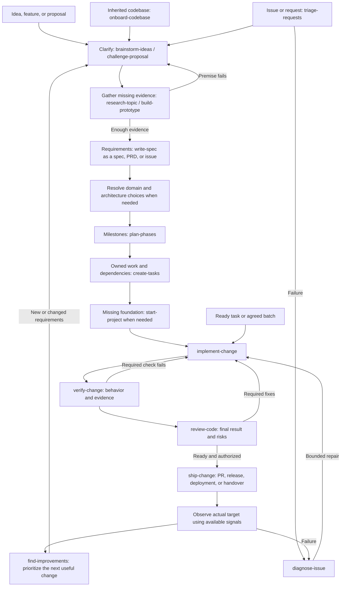
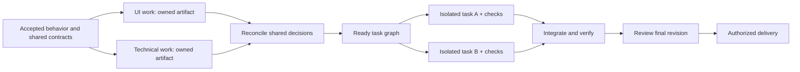

# Workflows

Select the requested result, use the narrowest matching skill, and carry accepted context forward. A workflow describes dependencies; the host supplies any actual scheduling, workers, isolation, and tools.

If the starting point is unclear, use `choose-skill` to recommend the next action from the current state. A ready task can go straight to its owning skill.

## Phases

| Phase | Purpose | Ready to continue when |
| --- | --- | --- |
| Intake | Establish the requested outcome, scope, starting point, and authority | The next action and material missing prerequisites are clear |
| Clarification | Explore alternatives, challenge the proposal, and expose consequential edge cases | The useful outcome and material choices are understood; assumptions needing evidence remain visible |
| Research | Inspect current reality or answer an uncertainty through code, sources, diagnosis, or experiments | Evidence supports a decision; unknowns are explicit |
| Requirements | Gather actors, scenarios, constraints, and acceptance criteria in a spec, PRD, or structured issue | Required behavior is agreed and testable; blocking choices are resolved |
| Planning | Resolve domain/technical choices, then derive phases and executable tasks as needed | Selected work has settled prerequisites, dependency order, ownership, and observable exits |
| Implementation | Make the scoped change under local conventions and update affected context | The requested behavior and relevant checks have observed evidence |
| Verification | Evaluate material criteria and collect usable proof of the result | Required behavior is demonstrated, evidence identifies its revision/context, and gaps are explicit |
| Review | Evaluate the selected result against intent and engineering/interface requirements | Findings, coverage, blocking fixes, and remaining risks are explicit |
| Delivery | Reach the requested PR, release, deployment, or handover target | The actual target and revision/artifact/behavior are verified |
| Operation | Observe the result, recover from incidents, and learn from use | Verified observations identify the next useful action or no further work |
| Improvement | Prioritize observed friction, failures, debt, or changed needs | A justified next change re-enters the appropriate stage without repeating settled work |

Clarification belongs wherever a consequential unknown occurs. A clarified proposal is not a validated concept: demand, feasibility, and performance assumptions need relevant evidence. A prototype creates research evidence even when code is used to build it. Verification can happen within implementation or as a dedicated `verify-change` pass; reuse completed checks that still apply. No phase requires a separate document or conversation turn. Relevant tests and checks are required; their order does not follow a mandatory test-first method.

## Lifecycle graph

Arrows show the main cycle, not mandatory ceremonies. Skip settled or irrelevant steps using the situation routes below; a ready task can enter implementation directly.

Operational feedback closes the loop: diagnosis for a failure, specification for changed behavior, or scoped upkeep. Reuse the delivered revision and observations, and update useful decisions, learnings, and incidents in their existing homes. The observation node uses the requested release checks and available monitoring; it does not install a monitoring platform or promise a continuous watch. For a selected phase that already has milestones, go directly to `create-tasks`; the graph does not require re-planning it.

Conventions and agent context apply throughout. UI flows, interface design, shared design systems, domain modeling, and architecture enter where the requested behavior needs them. Their catalogs provide the focused workflows; the lifecycle does not require every specialty on every change.

## Routes by situation

| Situation | Useful route |
| --- | --- |
| Greenfield project | Brainstorm → challenge assumptions → relevant research or prototype → requirements/spec → domain/technical design as needed → phases → tasks → starter/foundation → implementation → verification/review → delivery → observation |
| Inherited project | Onboard → preserve current behavior/data/contracts → select the actual change → define missing conventions/context only where needed → use the ordinary change route |
| Missing project knowledge | `document-project` → verify code, configuration, relevant history and accepted choices → update canonical docs and useful memory indexes → establish disputed rules or improve agent navigation only where needed |
| Architecture or AI capability | Establish product/workload and existing infrastructure constraints → `design-architecture` for boundaries, C4, services, costs and conditional AI contracts → prototype unresolved feasibility → plan/implement → exercise actual data/tool/approval boundaries → deliver and observe |
| Feature in a familiar project | Inspect the affected baseline → gather missing requirements/spec → design/task decomposition only where useful → implement/verify/review/deliver → observe |
| Bug or regression | Triage if the report is unverified → diagnose using reproduction and available signals → implement the bounded repair → verify affected consumers → review/deliver → consider an automated guard for a recurring cause |
| Result evaluation | Select checks from acceptance criteria → preserve useful baseline → observe candidate behavior → report results and evidence → include proof in authorized PR/delivery work |
| Improvement discovery | `find-improvements` across the requested repository, feature, or data layer → deduplicate confirmed candidates → choose the next investigation or scoped change |
| Refactor | Find evidenced candidates → select one → preserve behavior and define checks → implement the accepted scope → verify/review |
| Repeated coding mistake | Establish the accepted rule → `automate-code-checks` using existing enforcement where possible → demonstrate invalid failure and valid passes → adopt through normal review/delivery |
| Performance | `improve-performance` to measure/profile a representative path → repair when requested → compare correct behavior under equivalent conditions → review/deliver |
| Dependency upkeep | `upgrade-dependencies` to establish a compatible set and adapt consumers → verify resolution and runtime behavior → review/deliver |
| System or data transition | Settle the target architecture → `plan-migration` for compatibility, transfer, cutover, and recovery → phases/tasks → execute authorized stages with evidence gates |
| Large uncertain initiative | `track-project-decisions` → research/challenge/prototype the next ready choice → specify and plan sufficiently settled portions |
| PR communication | Explain the fixed comparison; question unresolved intent when needed; use review separately for correctness |
| UI work | Map flows → design the interface → build/evolve shared foundations only for repeated needs → implement → inspect/review rendered behavior |
| Documentation cleanup | Consolidate existing authoritative content and links; prepare agent entry points only where needed |

## Sequential and parallel work

Sequence work when one result determines another task's input. Required domain rules precede dependent contracts; shared schemas/foundations precede consumers; accepted behavior precedes its executable tasks; integration and relevant verification precede delivery.

`plan-phases` identifies which milestones can overlap and what closes each one. `create-tasks` preserves those dependencies while splitting a selected phase into owned, verifiable work. Distinguish work that could run together after named prerequisites from work ready now. A phase may start only when its own prerequisites hold; a task inside it may still wait on another task. Publish to the requested project-management destination only after checking existing work and granted write authority; reconcile uncertain writes before retrying and confirm stored results before claiming synchronization.

Parallel work needs ready inputs, independently checkable outputs, and isolated writes/state/data/verification environments. Different filenames alone do not establish independence. Read-only specialist investigations or reviews can run together on a fixed baseline. UI and technical design can run together once shared behavior is clear, with reconciliation before their consumers are implemented.

The coordinator owns shared decisions, reconciliation, integration, and readiness. Use host-supported workers/workspaces when available; Markdown instructions do not implement a scheduler. Small work remains sequential when delegation adds no useful independence.

Evaluation always uses a separate agent in fresh context, including for plans, research, code, and designs. Supply accepted criteria, the fixed candidate, relevant raw sources, and check access without the author's conversation or preferred conclusion. The reviewer tries to disprove material claims and inspects actual proof. Add reviewers only for distinct risks; preserve demonstrated defects through reconciliation and independently recheck affected results after fixes. Without an independent reviewer, the result remains unreviewed and cannot pass acceptance. This is separate from the user's required decisions and approvals.

A worker may not receive the parent conversation. Give it a bounded question or outcome, source scope/baseline, applicable instructions, accepted criteria, permitted actions and owned writes, expected evidence, and stop conditions. Research returns located findings and unresolved claims; the coordinator checks consequential evidence before adopting conclusions. Use host controls where available: separate context does not establish isolation of files, services, or credentials.

## Context and next actions

Pass the accepted objective, relevant artifacts and their versions where material, decisions, scope, repository revision/baseline, unresolved prerequisites, and verification evidence. Reconcile copied task criteria with authoritative inputs after a change; retain unaffected discoveries. For partial batches, preserve each task's outputs and actual disposition, stop dependent work when its prerequisite fails, and resume from observed state. Integration needs evidence for the combined revision. Each result should state the next useful action and why it fits.

Before context loss or an actual session transfer, condense those facts into the existing work record or a short continuation block, retaining pending operation IDs and useful file/symbol pointers. Remove repeated logs and search noise; retain authority, blockers and unchecked criteria. On resumption, reload applicable instructions and compare against current sources/state. Summaries guide that check; they do not replace evidence or require a new document or session.

| Completed result | Next action when needed |
| --- | --- |
| Selected idea with enough evidence | Write the behavior spec |
| Spec with unresolved technical choices | Design the relevant architecture; use a prototype for unproven feasibility |
| Accepted scope and design | Plan outcome-based phases, or create tasks directly for a small change |
| Agreed phase | Create executable tasks preserving its criteria and dependencies |
| Ready tasks | Establish a missing foundation, then implement one task or the agreed ready batch |
| Implemented change with proof missing | Verify the affected criteria and capture useful evidence |
| Verified change | Review the final revision using its evidence; include relevant proof when explaining or publishing the PR |
| Review findings | Investigate uncertain claims and implement selected authorized fixes; recheck affected evidence |
| Reviewed change and delivery authority | Deliver to the requested target and verify it |
| Delivery observed | Diagnose failures, prioritize evidenced improvements, or record that no follow-up is justified; carry the observations into the next cycle |

A bounded request finishes with its result and a recommendation. An authorized end-to-end request continues through ready stages without invented confirmation stops. Use `prepare-handoff` for an owner/session transfer or context compaction, not between every skill.

Recommendations can name another skill, but invocation depends on host support and installation. Each skill remains useful alone; describe the next plain action if its sibling is unavailable.

## Artifacts and side effects

Update existing authoritative records. Current behavior, a specification, a decision, a learning, an incident, and a contributor standard have different roles, but they do not require empty folders or a new file every time context moves. Use a memory index when it improves retrieval: link records with scope/status and a refresh trigger rather than copying their contents. Keep temporary run state separate; conflicting or stale memory requires evidence before reuse. AGENTS.md points to the applicable project knowledge.

At task or workflow completion, follow the requested audience, tone, depth and project template. Default to a concise result, its purpose, the relevant method, observed verification and exact gaps or next action. A technical walkthrough can be detailed when requested; a PR should let a reviewer understand the changed behavior and evidence quickly. Update durable knowledge in place and link it from the summary. Repeated summaries are not new sources of truth.

Keep task-system integration within the requested destination and authority. Inspect project/state/concurrency rules and existing items before remote writes. Preserve local work, secret values, and private records. Delivery, production changes, destructive operations, and external communication require the actual action's authority; already-granted authority remains valid.

A check invocation is not evidence of success. Inspect outcomes and report exact failures or unavailable checks. A prototype is not production-ready software; a scoped review does not prove the whole system correct; a command completing does not prove the remote target is healthy.

Verification records the material criterion, tested revision/environment, actual observation, and result. Visible changes use relevant rendered evidence; performance/data claims use comparable measurements; behavioral changes use reproducible interactions or check output. New behavior need not invent a historical baseline. PRs carry concise results and useful accessible artifact links, with comparison conditions and unchecked coverage. Inspect and redact evidence before authorized sharing, verify uploaded locations, and label anything still local. After follow-up edits, refresh the affected proof and PR claims.
